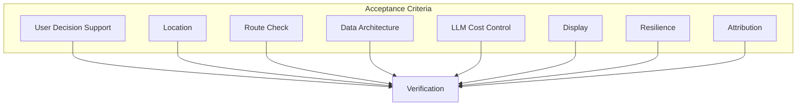

# Acceptance Criteria (Revised Brief)

Success checklist for Flood Watch per `docs/BRIEF.md`. Criteria are phrased so they can be verified or tested.

---

## 1. User Decision Support

### 1.1 House at Flood Risk

**Criterion**: For a user in a flood warning area, the app surfaces whether their house is at risk and whether they should deploy defences or evacuate.

**Verification**: Given flood warnings for the user's area, the AI summary includes advice that maps to: Stay and defend / Evacuate (risk to life).

---

### 1.2 Car at Risk

**Criterion**: The app helps users avoid getting stuck in their car by showing road incidents and flood–road correlation.

**Verification**: When road incidents exist (especially flood-related), the AI summary advises on driving risk and which routes to avoid.

---

### 1.3 Decision Framework

**Criterion**: Output prioritises: Danger to Life → road closures → general flood alerts.

**Verification**: Severe flood warnings and road closures appear first in the summary and action steps.

---

## 2. Location

### 2.1 Lookup Methods

**Criterion**: Users can enter location via postcode, address, or What3Words.

**Verification**:

| Method | Status |
|--------|--------|
| Postcode | Required |
| Address | Required |
| What3Words | Required |

All resolve to coordinates used for flood, road, and forecast checks.

---

### 2.2 Persistence

**Criterion**: The app remembers the user's previous location.

**Verification**: On return visit, the last-used location is pre-filled or auto-loaded; user sees their area without re-entering.

---

## 3. Route Check

**Criterion**: Users can check if roads are clear between their location and a destination.

**Verification**:

- Input: From (postcode/address/What3Words) + To (postcode/address/What3Words)
- Output: Route clear / blocked / at risk with alternatives when blocked
- Route uses real road incidents and flood areas along the path

---

## 4. Data Architecture

### 4.1 Backend Polling

**Criterion**: Flood, road, river, and weather data are polled by the backend at most every 15 minutes and stored.

**Verification**: Scheduled job runs on interval; user requests read from store, not from live API calls (except when store is cold or expired).

---

### 4.2 Geographic Caching

**Criterion**: Users in similar areas share cached data.

**Verification**: Two users in the same grid cell or postcode sector receive data from the same cache; no duplicate API calls for the same area within TTL.

---

### 4.3 Poll Intervals

**Criterion**: Weather, traffic, and water levels are not fetched more than every 15 minutes.

**Verification**: Config and job definitions enforce TTL ≥ 15 min for these data types.

---

## 5. LLM Cost Control

### 5.1 Response Caching

**Criterion**: When location and underlying data are unchanged, the app returns a cached response without calling the LLM.

**Verification**: Repeat request for same location with unchanged data → no new OpenAI call; cached response returned.

---

### 5.2 Trivial Case Handling

**Criterion**: When there are no alerts and no incidents, the app avoids or minimises LLM use.

**Verification**: "No alerts" case uses minimal or no LLM (e.g. template or deterministic output).

---

## 6. Display

### 6.1 Mobile Condensed

**Criterion**: On mobile, the app shows a condensed view: risk level, alerts, roads, and key advice.

**Verification**: Layout is scannable on small screens; primary information visible without horizontal scroll.

---

### 6.2 Desktop Enhanced

**Criterion**: On larger screens, the app shows an enhanced dashboard: map, lists, forecast, route check, more detail.

**Verification**: Desktop layout includes map, full lists, forecast, and route check when implemented.

---

## 7. Resilience

**Criterion**: If one API is down, the app still reports on available data rather than failing.

**Verification**: Manual test: disable one API; app returns partial summary with available data and clear indication of missing data.

---

## 8. Attribution

**Criterion**: The UI displays required Environment Agency and National Highways data credits.

**Verification**: Footer includes EA and NH attribution per their terms.

---

## Summary

| Category | Criterion | Status |
|----------|-----------|--------|
| **User needs** | House at risk advice | [ ] |
| | Car at risk advice | [ ] |
| | Decision prioritisation | [ ] |
| **Location** | Postcode lookup | [x] Met |
| | Address lookup | [ ] |
| | What3Words lookup | [ ] |
| | Remember previous location | [x] Partial (localStorage) |
| **Route check** | From/To route status | [ ] |
| **Data** | Backend polling (15 min) | [ ] |
| | Geographic caching | [ ] |
| | Poll intervals enforced | [ ] |
| **LLM** | Response caching | [ ] |
| | Trivial case skip | [ ] |
| **Display** | Mobile condensed | [ ] |
| | Desktop enhanced | [ ] |
| **Resilience** | Graceful API failure | [x] Met |
| **Attribution** | EA + NH credits | [x] Met |

---

## Reference

- **Brief**: `docs/BRIEF.md`
- **Architecture**: `docs/ARCHITECTURE.md`
- **LLM data flow**: `docs/LLM_DATA_FLOW.md`
