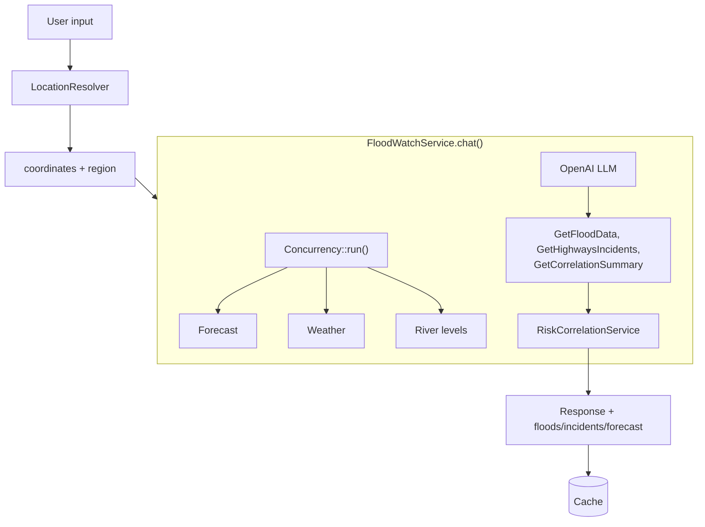

# Flood Watch Architecture

## Overview

Flood Watch correlates Environment Agency flood data with National Highways road status to provide a single source of truth for flood and road viability in the South West (Bristol, Somerset, Devon, Cornwall).

**Product brief**: See `docs/BRIEF.md` for the revised scope – user decision support (house/car at risk), location lookup (postcode, address, What3Words), route check, backend polling, and LLM cost control.

**Connectivity constraint**: Users may check at home then go to the Levels with limited data. The app must be fast to load, cache aggressively, and persist to localStorage so last-known state is available when offline or connectivity is poor.

## Domain Structure

```
app/
├── Flood/                    # Flood domain
│   ├── DTOs/FloodWarning
│   ├── Enums/SeverityLevel
│   └── Services/
│       ├── EnvironmentAgencyFloodService
│       ├── FloodForecastService
│       └── RiverLevelService
├── Roads/                    # Roads domain
│   ├── DTOs/RoadIncident
│   └── Services/NationalHighwaysService
├── Services/                 # Orchestration
│   ├── FloodWatchService     # Main LLM orchestration
│   ├── FloodWatchPromptBuilder
│   ├── RiskCorrelationService
│   ├── LocationResolver
│   ├── PostcodeValidator
│   └── WeatherService
├── DTOs/RiskAssessment       # Cross-cutting
├── Enums/Region
└── ValueObjects/Postcode
```

## Data Flow



1. **User input** → LocationResolver (postcode/place) → coordinates + region
2. **FloodWatchService.chat()** pre-fetches in parallel via `Concurrency::run()`: forecast, weather, river levels (flood alerts are not pre-fetched)
3. **LLM** receives system prompt + tools; calls GetFloodData (flood alerts), GetHighwaysIncidents (road status), GetCorrelationSummary, etc. Tool calls are LLM-driven
4. **RiskCorrelationService** applies deterministic rules (flood↔road pairs, predictive warnings)
5. **Response** synthesized by LLM, cached, returned with floods/incidents/forecast

## Extension Points

### Prompts

- **Location**: `resources/prompts/{version}/system.txt`
- **Config**: `flood-watch.prompt_version` (env: `FLOOD_WATCH_PROMPT_VERSION`)
- **Snapshot tests**: `tests/Feature/Services/FloodWatchPromptBuilderTest.php` – update snapshots when changing prompts (`sail test -- --update-snapshots`)

### Region Logic

- **Config**: `config/flood-watch.regions` – prompt snippets per region
- **Correlation**: `config/flood-watch.correlation` – flood_area_road_pairs, predictive_rules (river_pattern + flood_pattern), key_routes. Muchelney rule: triggers when River Parrett is elevated or when Langport has flood warnings; region defaults to somerset for default Langport coordinates.
- **Expanding regions**: Add region to `regions`, correlation rules to `correlation.{region}`, key routes to `incident_allowed_roads`, road coordinates to `incident_road_coordinates`. See `docs/CONSIDERATIONS.md`.

### External APIs

| Service | Config key | Fixture |
|---------|------------|---------|
| Environment Agency | `flood-watch.environment_agency` | `tests/fixtures/environment_agency_*.json` |
| National Highways | `flood-watch.national_highways` | `tests/fixtures/national_highways_closures.json` |
| Flood Forecast | `flood-watch.flood_forecast` | - |
| Weather | `flood-watch.weather` | - |

**National Highways (v2.0)**: `GET https://api.data.nationalhighways.co.uk/roads/v2.0/closures?closureType=planned|unplanned`. DATEX II v3.4 D2Payload with `situation[]` → `situationRecord[]` → `sitRoadOrCarriagewayOrLaneManagement`. Fetches both planned and unplanned closures (config: `fetch_unplanned`). Headers: `Ocp-Apim-Subscription-Key`, `X-Response-MediaType: application/json`.

**Incident filtering (county limits)**: Road incidents are filtered to only M4, M5 and A roads within the South West. When the user's region is known (from postcode), only that region's `key_routes` from `correlation.{region}` are shown. When unknown, `flood-watch.incident_allowed_roads` (A30, A303, A361, A372, A38, M4, M5) is used. Incidents on roads outside this list (e.g. A120, M6) are excluded from the dashboard and LLM context.

### Resilience

- **Retry**: All HTTP calls use `retry(times, sleepMs, null, false)` – configurable per service
- **Circuit breaker**: Wired into all external API services (Environment Agency, Flood Forecast, River Level, National Highways, Weather). After N consecutive failures, the circuit opens and requests return empty until cooldown expires. Config: `flood-watch.circuit_breaker` – `enabled` (default: true), `failure_threshold` (default: 5), `cooldown_seconds` (default: 60). Env: `FLOOD_WATCH_CIRCUIT_BREAKER_ENABLED`, `FLOOD_WATCH_CIRCUIT_FAILURE_THRESHOLD`, `FLOOD_WATCH_CIRCUIT_COOLDOWN`.
- **Graceful degradation**: When one API fails, app returns partial summary with available data and clear indication of missing data (see ACCEPTANCE_CRITERIA). No cached-data fallback when circuit is open – consider serving last-known cache per area.
- **Cache**: `flood-watch.cache_key_prefix` ensures distinct keys across services

See `docs/CONSIDERATIONS.md` for API dependency risks and expansion guidance.

### LLM Token Limits

- Tool results are truncated before sending to the LLM to avoid exceeding context length (128k tokens).
- Config: `flood-watch.llm_max_floods` (12), `llm_max_incidents` (12), `llm_max_river_levels` (8), `llm_max_forecast_chars` (1200), `llm_max_flood_message_chars` (150).
- Reduce these via env vars (`FLOOD_WATCH_LLM_MAX_*`) if you still hit limits.

### Logging

- **LogMasker**: Redacts user content, tool arguments, API responses before debug logs
- Sensitive data never appears in logs

## Performance & Scalability

### Cache Pre-warming

Run `php artisan flood-watch:warm-cache` to pre-populate the cache for common locations. Schedule in `routes/console.php`:

```php
Schedule::command('flood-watch:warm-cache --locations=Langport,TA10,Bristol')->hourly();
```

### Background Refresh

The main `chat()` flow is synchronous. For high traffic, consider:

- **Queue**: Move `FloodWatchService::chat()` to a job for async processing; return a job ID and poll for results
- **Cache TTL**: `flood-watch.cache_ttl_minutes` – balance freshness vs API load
- **Correlation**: `RiskCorrelationService::correlate()` is fast and in-memory; no queuing needed

### Scaling Notes

- **Redis**: Use for cache and trends in production (`flood-watch.cache_store`, `flood-watch.trends_enabled`)
- **Concurrency**: Pre-fetch (forecast, weather, river levels) runs in parallel via `Concurrency::run()`. Flood alerts and road incidents are fetched when the LLM calls GetFloodData and GetHighwaysIncidents. Driver: `sync` (default, in-process) vs `process` (spawns PHP processes). Use `sync` for testing (`phpunit.xml` sets `CONCURRENCY_DRIVER=sync`). Use `process` in production for better parallelism under load. Env: `CONCURRENCY_DRIVER` (or `APP_CONCURRENCY_DRIVER` depending on Laravel version).
- **Polygon limit**: `flood-watch.environment_agency.max_polygons_per_request` caps polygon fetches per request

## AI Development

- **Laravel Boost**: MCP server, guidelines, `search-docs` for version-specific Laravel/Pest/Tailwind docs
- **Cursor skills**: `.cursor/skills/` (livewire-development, pest-testing, tailwindcss-development) and `.cursor/rules/` (laravel-boost.mdc) tracked in version control
- **MCP config**: `.cursor/mcp.json` for Laravel Boost

## LLM and Data Flow

See **`docs/LLM_DATA_FLOW.md`** for a detailed description of how data flows to the LLM, which tools are available, what the LLM receives (and its limits), and how correlation works.

## Key Files

| Purpose | File |
|---------|------|
| Main entry | `FloodWatchDashboard` (Livewire) |
| Orchestration | `FloodWatchService` |
| Correlation rules | `RiskCorrelationService` + config |
| Prompts | `FloodWatchPromptBuilder` + `resources/prompts/` |
| Cache warm | `flood-watch:warm-cache` command |
| Development plan | `docs/PLAN.md` |
