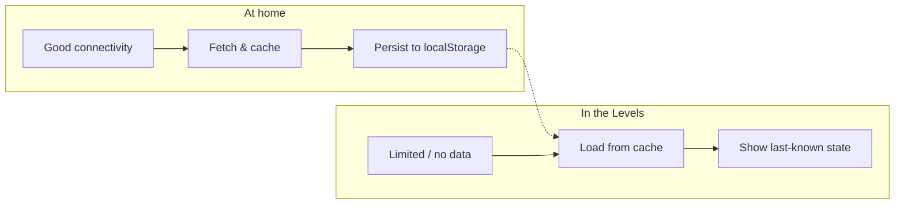
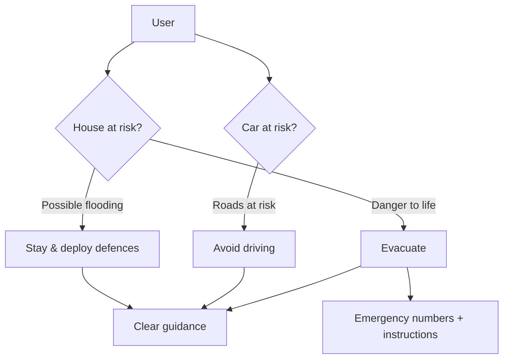
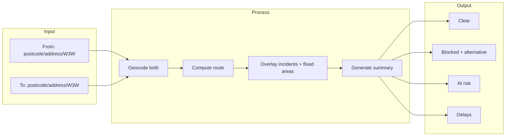
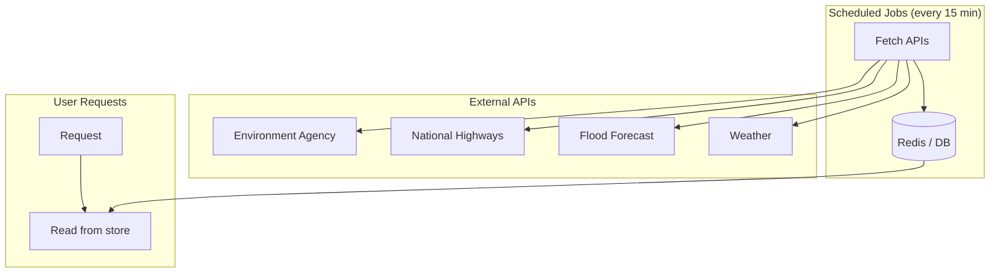
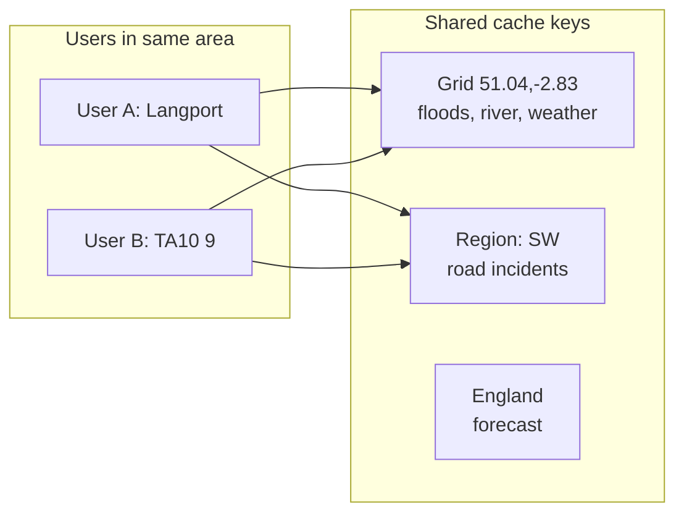

# Flood Watch – Product Brief (Revised)

**Version**: 2.0  
**Date**: 2026-02-05

---

## 1. Context

I live near the Somerset Levels and we are in the middle of a very wet season. There is a lot of flood risk and this affects infrastructure.

I am an app developer and want to build an app that uses OpenAI to process data from various available APIs and present the current and future flood risk and helpful advice to a user. We have access to flood level data, weather, Highways, and Environment Agency APIs. It should provide a condensed version on mobile displays and an enhanced dashboard display when viewed on larger screens.

---

## 2. Primary User Need

**Locals**, especially in flood-prone areas, need to answer three questions:

1. **Is my house at flood risk?**  
   → Do I need to deploy flood defences or, at worst, flee due to risk to life?

2. **Could I get stuck in my car?**  
   → Is it safe to drive? Where might I get stranded or damage my vehicle?

3. **What should I do?**  
   → **Stay and deploy defences** · **Avoid driving** · **Evacuate** (risk to life)

The app must help users make these decisions quickly and clearly.

---

## 2.1 Connectivity Constraint

**Users may check at home (good connectivity) then find themselves in the Levels with limited or no data access.**

The app must be **fast to load** and **optimise cache and local storage** so that:

- **At home**: Fetch and cache aggressively; store last results in local storage.
- **In the Levels**: Show cached results immediately; work from last-known state when online access is poor or unavailable.

**Implications**: Minimise initial payload; prioritise instant render from cache; treat localStorage as the fallback when the user is cut off.

When **Danger to Life** is detected (e.g. severe flood warning), the app must:
- Show **relevant emergency phone numbers** (999, Floodline 0345 988 1188)
- Provide **clear instructions** (evacuate, move to higher ground, call 999 if life at risk)

---

## 3. Location

### 3.1 Lookup

Users can enter their location via:

| Method | Example |
|--------|---------|
| **Postcode** | TA10 9 |
| **Address** | High Street, Langport |
| **What3Words** | ///word.word.word |

All resolve to coordinates for flood, road, and forecast checks.

### 3.2 Persistence

The app must **remember the user's previous location** so that returning users see their area immediately without re-entering.

| User type | Storage |
|-----------|---------|
| **Guest** | Browser storage (localStorage) – last location only |
| **Registered** | Profile default location + bookmarks – multiple locations; quick switch between home, work, relatives, etc. |

Registered users can **bookmark more than one location** and switch between them. A **default location** is stored in the user's profile and pre-loaded on app open. Example: home (Langport), parents (Muchelney), work (Taunton). Each bookmark stores the resolved coordinates and label (postcode or place name). Default locations feed user metrics for the admin dashboard.

---

## 4. Route Check

**Use case**: "I'm in a flooded area – are the roads clear between where I am and where I want to go?"

| Input | Output |
|-------|--------|
| **From** (postcode/address/What3Words) | Route status: |
| **To** (postcode/address/What3Words) | • **Clear** – Route appears passable |
| | • **Blocked** – Road closed at X, alternative via Y |
| | • **At risk** – Route crosses flood warning area |
| | • **Delays** – Lane closures, expect delays |

The app computes the route, overlays incidents and flood areas, and provides a clear summary with alternatives when applicable.

---

## 5. Data Architecture

### 5.1 Backend Polling

API data is **polled and stored by the backend**, not fetched on each user request.

| Data | Poll interval |
|------|----------------|
| Flood warnings | 15 min |
| Road incidents | 15 min |
| River levels | 15 min |
| Weather | 15 min |
| 5-day forecast | 1–2 hours |

Scheduled jobs fetch from APIs and write to a shared store. User requests read from the store.

### 5.2 Geographic Caching

Data is cached by **geographic area** so users in similar locations share the same cache:

- Floods, river levels, weather: cache by grid cell or postcode sector
- Road incidents: single region-wide cache (shared by all)
- Forecast: single cache (England-wide)

### 5.3 LLM Cost Control

We must always consider LLM cost:

- **Cache full responses** when location + data are unchanged
- **Skip LLM** when the answer is trivial (e.g. no alerts)
- **Reuse responses** across users in the same area with unchanged data

---

## 6. Display

| Viewport | Layout |
|----------|--------|
| **Mobile** | Condensed, scannable – risk level, alerts, roads, key advice. **Map may be omitted** if too heavy for mobile (tiles, payload) and screen is small – prioritise text and cached state over map. |
| **Desktop** | Full dashboard – map, lists, forecast, route check, more detail |

---

## 7. Data Sources

| Source | Data |
|--------|------|
| Environment Agency | Flood warnings, river levels |
| Flood Forecasting Centre | 5-day forecast |
| National Highways | Road incidents (DATEX II) |
| Open-Meteo (or similar) | Weather |
| What3Words API | Location lookup (optional) |
| Routing (OSRM, etc.) | Route geometry for route check |

---

## 8. Summary

Flood Watch helps locals in flood-prone areas decide:

- **Stay and defend** – deploy defences if flooding is possible but not imminent
- **Avoid driving** – roads at risk or closed; high chance of getting stuck
- **Evacuate** – severe or danger-to-life warnings

Core features:

- Location lookup (postcode, address, What3Words) with persistence
- Route check (From → To: clear / blocked / at risk)
- Backend polling and geographic caching for fast, shared access
- LLM cost control: cache responses, skip when trivial
- Responsive UI: condensed on mobile, enhanced on desktop
