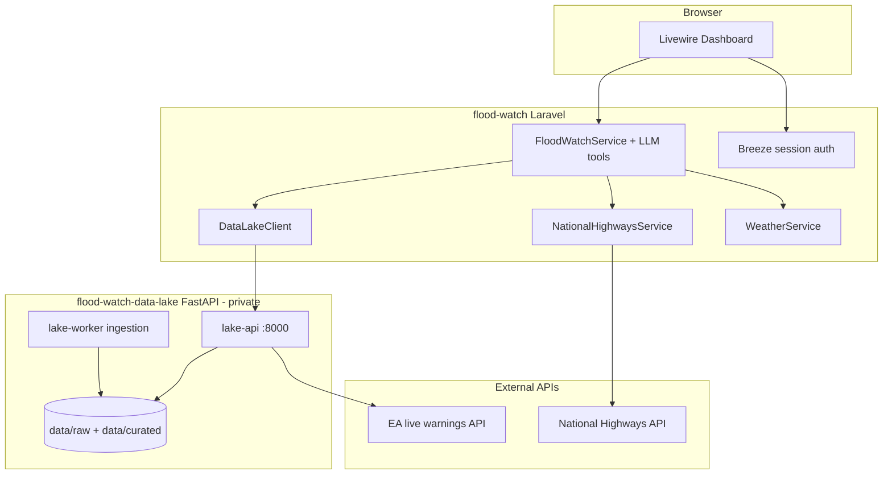

# Flood Watch → Data Lake migration plan

**Purpose:** Handoff for a dedicated agent (or long-running chat) to continue the strangler migration from a Laravel monolith to a FastAPI data lake backend.

**Last updated:** 2026-07-11

---

## Repositories and sensitivity

| Repo | Local path | Remote | Visibility |
|------|------------|--------|------------|
| **Flood Watch** (Laravel monolith) | `/Users/mike/Projects/flood-watch` | `git@github.com:iammikek/floodwatch.git` | Public |
| **Flood Watch Data Lake** (FastAPI) | `/Users/mike/Projects/flood-watch-data-lake` | `git@bitbucket.org:automica/floodwatch-data-lake.git` | **Private** — proprietary EA-derived data and ingestion; do not reference data artifacts in public commits or issues |

**Rule for agents:** Work on both repos locally. Only push **flood-watch** changes to GitHub unless the user explicitly asks to push the data lake. Never copy curated/raw data files into the public repo.

---

## North star

**Laravel keeps:** Livewire UX, Breeze session auth, OpenAI tool orchestration (`FloodWatchService`), user data (`users`, `user_searches`, `location_bookmarks`, `llm_requests`), admin, National Highways / Somerset / weather (until ingested), guest rate limits, scheduled cache warming.

**Data lake owns:** EA hydrology read API — measurements, curated polygons, MVT tiles, live warnings — with ETag caching, rate limits, and ingestion workers.

**Not in scope (yet):** Replacing Laravel auth, Livewire, or LLM orchestration with FastAPI. PostGIS, RAG, HiPIMS depth, fleet GPX — Phase 2+ per `flood-watch-data-lake/docs/project-brief.md`.

---

## Current state (verified 2026-07-11)

### Data lake (Phase 1 — largely done)

| Endpoint | Status |
|----------|--------|
| `GET /healthz` | Implemented |
| `GET /v1/measurements` | Implemented (NDJSON.gz, raw/hour/day, bbox) |
| `GET /v1/polygons` | Implemented (metadata + inline GeoJSON) |
| `GET /v1/polygons/tiles/{dataset}/{z}/{x}/{y}` | Implemented |
| `GET /v1/warnings` | Implemented (EA live + geometry) |
| `GET /v1/rainfall` | Stub |
| `GET /v1/forecast` | Stub |
| `GET /v1/retrieve-context` | Stub (RAG) |
| `POST /v1/jobs/backfill` | Stub |

Stack: Python 3.11, FastAPI, file-backed `data/raw/` + `data/curated/`, in-memory cache + per-IP rate limit, Docker Compose (`lake-api`, `lake-worker`), unittest suite, Bitbucket CI.

Spec: `flood-watch-data-lake/docs/openapi-data-lake.yaml`

### Laravel integration (partial — ahead of original plan doc)

`docs/plan.md` § Data Lake Integration still mentions `use_data_lake` feature flag default **off**. **Code has moved on:**

- `EnvironmentAgencyFloodService` → **lake only** (`/v1/warnings` via `DataLakeClient`)
- `RiverLevelService` → **lake first**, EA direct API **fallback** if lake empty/errors
- Controllers proxy lake: `FloodWatchWarningsController`, `FloodWatchPolygonsController`, `FloodWatchTilesController`, `FloodWatchRiverLevelsController`
- `DataLakeClient` — ETag/304, retry on 429/5xx, rate-limit header backoff
- Config: `config/flood-watch.php` → `data_lake.base_url` (`FLOOD_WATCH_DATA_LAKE_URL`, default `http://localhost:8000`)
- LLM tools: `GetFloodDataHandler`, `GetRiverLevelsHandler` report `provider: data_lake`
- Tests: `tests/Feature/Api/*`, `tests/Feature/Flood/Services/*DataLake*`

**Still direct from Laravel (not in lake):** National Highways, Somerset Council scraper, flood forecast, weather, OpenAI, Nominatim/postcodes.io.

---

## Architecture diagram



---

## Workstreams (pick one per sprint)

### Workstream A — Contract hardening (Laravel, public repo)

**Goal:** Make the Laravel ↔ lake boundary explicit, tested, and documented.

| # | Task | Files | Done when |
|---|------|-------|-----------|
| A1 | Update `docs/plan.md` Data Lake section to match reality (remove stale `use_data_lake` flag narrative) | `docs/plan.md` | Doc matches code |
| A2 | Document env vars in `.env.example` | `.env.example`, `docs/deployment.md` | `FLOOD_WATCH_DATA_LAKE_URL` documented |
| A3 | Add OpenAPI-driven contract test or snapshot tests for `DataLakeClient` response shapes | `tests/Feature/...`, `app/Services/DataLakeClient.php` | Warnings, measurements, polygons shapes locked |
| A4 | Health dashboard: lake status already in `HealthController` — ensure admin UI surfaces it | `app/Http/Controllers/HealthController.php`, admin views | Admin shows lake up/down + latency |
| A5 | Remove EA direct fallback in `RiverLevelService` once lake reliability proven in staging | `app/Flood/Services/RiverLevelService.php` | Single code path; delete `@deprecated` private methods |

**Tests:** `sail test` or `./vendor/bin/pest` — must stay green. CI: `.github/workflows/tests.yml`.

---

### Workstream B — Lake Phase 1 completion (private repo)

**Goal:** Finish stubs Laravel will need before extracting more domains.

| # | Task | Files | Done when |
|---|------|-------|-----------|
| B1 | Implement real `POST /v1/jobs/backfill` + job status (minimal: SQLite or file-based job registry) | `api/routes/`, `api/services/` | Worker can resume month-sliced EA backfill |
| B2 | Service-to-service auth: Bearer token middleware (config `LAKE_API_TOKEN`) | `api/deps.py`, `api/main.py` | Laravel sends `Authorization: Bearer`; lake rejects missing/invalid |
| B3 | Structured error contract `{ detail, code }` aligned with *-101 family | `api/models.py`, handlers | Laravel can map errors consistently |
| B4 | Redis cache adapter (optional but planned in ROADMAP) | `api/utils/cache.py` | Configurable in-memory vs Redis |
| B5 | Expand tests for edge cases: empty bbox, 304 chains, rate limit headers | `tests/` | `make test-api` green in Docker |

**Tests:** `make test` / `make test-api` inside `flood-watch-data-lake`.

**Do not** commit raw EA data or curated GeoJSON to GitHub.

---

### Workstream C — Next domain extraction (joint)

**Goal:** Move the next highest-churn external reads into the lake.

**Candidate order** (confirm with user):

1. **National Highways incidents** — ingestion in `lake-worker`; new `GET /v1/roads/incidents?bbox=&region=`
2. **Rainfall / forecast** — only if LLM tools or dashboard still call Met/FGS directly today

| # | Task | Owner repo |
|---|------|------------|
| C1 | Add NH ingestion job + curated store | data-lake |
| C2 | Expose `/v1/roads/incidents` OpenAPI + implementation | data-lake |
| C3 | `NationalHighwaysService` → `DataLakeClient` with EA-style fallback | flood-watch |
| C4 | Pest tests with `Http::fake` | flood-watch |
| C5 | Deprecate direct NH HTTP in Laravel | flood-watch |

**Stays in Laravel until Phase 2:** OpenAI orchestration, Reverb/push, bookmarks UX, guest rate limits.

---

### Workstream D — Deployment wiring

| # | Task | Notes |
|---|------|-------|
| D1 | Lake on private infra (AWS Terraform/CloudFormation exists under `infra/aws/`) | ECR push scripts present locally (`scripts/aws-ecr-push.sh` — untracked) |
| D2 | Laravel `FLOOD_WATCH_DATA_LAKE_URL` → staging/prod lake URL | Railway or AWS |
| D3 | M2M token in Laravel `.env` + lake `LAKE_API_TOKEN` | Never commit secrets |

---

## Agent working conventions

1. **Read first:** `docs/architecture.md`, `docs/agents-and-llm.md`, `docs/plan.md`, this file; lake: `docs/openapi-data-lake.yaml`, `docs/ROADMAP.md`.
2. **TDD:** Failing Pest/unittest → implement → green. Run tests after each task.
3. **Laravel:** `sail up` / `sail test`; PHPStan level per project config.
4. **Lake:** `docker compose up` in data-lake repo; API on port **8000** by default.
5. **Local pairing:** Point `FLOOD_WATCH_DATA_LAKE_URL=http://localhost:8000` in flood-watch `.env`.
6. **Commits:** Small, per-repo. Public repo only on GitHub unless user asks otherwise.
7. **No bragging:** Do not add public README/marketing for the data lake; keep proprietary context in private Bitbucket.

---

## Suggested sprint order (first 2 weeks)

```text
Week 1
  Day 1–2  A1–A3  Contract tests + doc sync (flood-watch)
  Day 3–4  B2     M2M auth on lake + Laravel client header
  Day 5    B1     Real backfill job (minimal)

Week 2
  Day 1–2  A5     Remove EA fallback after lake auth + staging smoke test
  Day 3–5  C1–C3  National Highways extraction (if user confirms priority)
```

---

## Key file index

### flood-watch (Laravel)

```
app/Services/DataLakeClient.php          # HTTP client to lake
app/Flood/Services/
  EnvironmentAgencyFloodService.php      # warnings → lake
  RiverLevelService.php                  # measurements → lake (+ EA fallback)
app/Http/Controllers/
  FloodWatchWarningsController.php
  FloodWatchPolygonsController.php
  FloodWatchTilesController.php
  FloodWatchRiverLevelsController.php
  HealthController.php                   # includes data_lake health
config/flood-watch.php                   # data_lake.* config
routes/web.php                           # /api/lake/* proxies
tests/Feature/Flood/Services/*DataLake*
docs/plan.md                             # § Data Lake Integration (needs sync)
```

### flood-watch-data-lake (FastAPI, private)

```
api/main.py
api/routes/{measurements,polygons,warnings}.py
api/services/
api/models.py
ingestion/cli.py
docs/openapi-data-lake.yaml
docs/ROADMAP.md
docs/project-brief.md
compose.yaml
Makefile
```

---

## How to start the new agent

1. Open a **new Cursor chat** rooted at `/Users/mike/Projects/flood-watch`.
2. First message:

   ```text
   Read docs/DATA_LAKE_MIGRATION_PLAN.md and docs/architecture.md.
   Local lake repo: /Users/mike/Projects/flood-watch-data-lake (private Bitbucket).
   Start Workstream A (contract hardening) unless I say otherwise.
   ```

3. For lake-only tasks, `@` mention files in both workspaces or temporarily add the data-lake folder to the workspace.

---

## Open questions for Mike

- [ ] Priority: **A** (contract/tests) vs **C** (National Highways extraction) first?
- [ ] Target hosting for lake API in staging (localhost Docker vs AWS)?
- [ ] Remove EA fallback in `RiverLevelService` now or after N days of lake-only staging?
- [ ] Any Bitbucket pipeline gaps vs GitHub CI on flood-watch?

---

## Related docs

| Doc | Location |
|-----|----------|
| Original integration plan | `flood-watch/docs/plan.md` § Data Lake Integration |
| System architecture | `flood-watch/docs/architecture.md` |
| LLM tools | `flood-watch/docs/agents-and-llm.md` |
| Lake roadmap | `flood-watch-data-lake/docs/ROADMAP.md` |
| Lake OpenAPI | `flood-watch-data-lake/docs/openapi-data-lake.yaml` |
| Long-term vision | `flood-watch-data-lake/docs/project-brief.md` |
