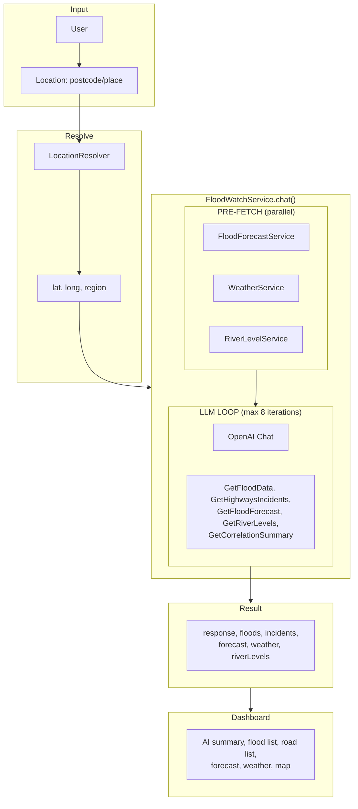
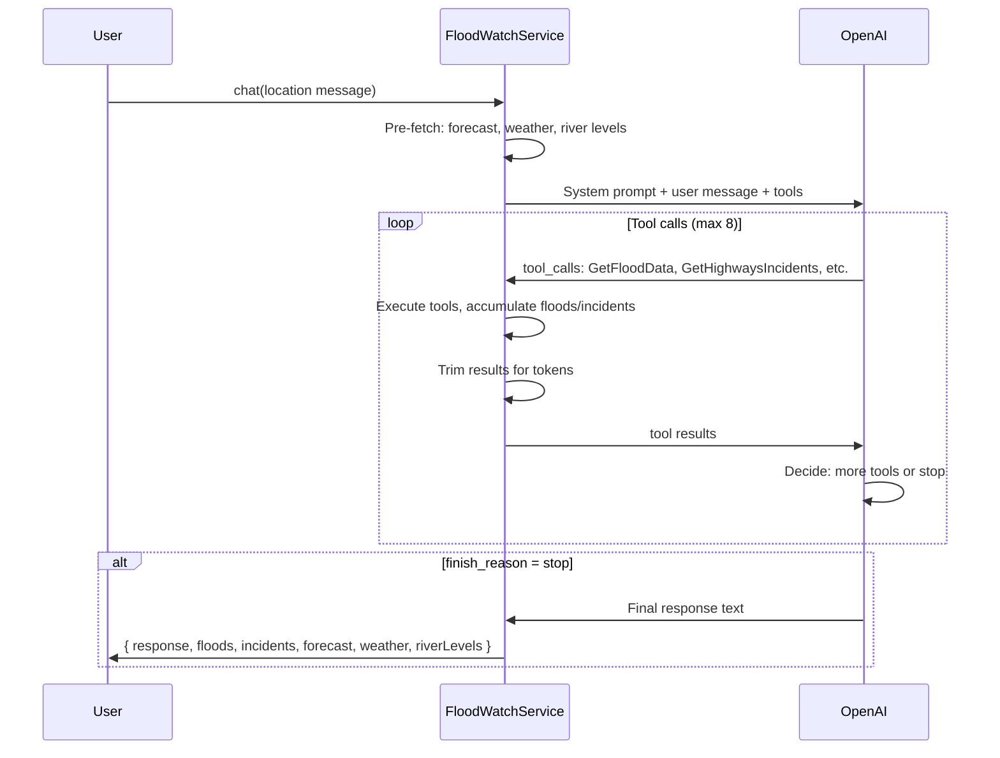

# How Flood Watch Uses Data with the LLM

**Created**: 2026-02-05  
**Purpose**: Document the app's essence – what we've built, what data flows where, and how the LLM consumes it.

---

## 1. Built Elements

| Element | Description | Data Source |
|--------|-------------|-------------|
| **AI Summary** | "Current Status" + "Action Steps" narrative | LLM synthesis |
| **Flood Warnings** | List of EA flood alerts with severity, message, timestamps | GetFloodData tool |
| **Road Status** | National Highways incidents (closures, lane closures) | GetHighwaysIncidents tool |
| **5-Day Forecast** | Flood risk outlook from Flood Forecasting Centre | GetFloodForecast tool (pre-fetched) |
| **Weather** | Open-Meteo 5-day forecast | WeatherService (pre-fetched) |
| **River Levels** | EA monitoring stations (levels, status: elevated/expected/low) | GetRiverLevels tool (pre-fetched) |
| **Map** | Leaflet map with flood markers, polygons, river gauges, road incidents | Same floods/incidents/riverLevels from chat result |
| **Correlation** | Flood↔road cross-references, predictive warnings (e.g. Muchelney) | GetCorrelationSummary tool |

---

## 2. Data Flow Overview

---

## 3. What the LLM Receives

### 3.1 System Prompt

- **Base**: `resources/prompts/v1/system.txt` – South West Emergency Assistant, prioritization (Danger to Life → road closures → general alerts), output format (Current Status, Action Steps).
- **Region**: Injected from `config/flood-watch.regions` based on postcode (e.g. Somerset: Muchelney, North Moor ↔ A361, key routes).

### 3.2 User Message

- Default: "Check status" (Langport coordinates).
- With location: "Check status for {place} (lat: x, long: y)" – coordinates from LocationResolver.

### 3.3 Tool Results (what the LLM sees)

| Tool | Data Sent to LLM | Limits |
|------|------------------|--------|
| **GetFloodData** | Floods without polygons; message truncated to 150 chars | max 12 floods |
| **GetHighwaysIncidents** | Incidents (road, status, type, delay, start/end, location, managementType, isFloodRelated) | max 12 |
| **GetRiverLevels** | Stations, river, level, unit, levelStatus (elevated/expected/low) | max 8 |
| **GetFloodForecast** | england_forecast (truncated), flood_risk_trend, sources | 1200 chars forecast |
| **GetCorrelationSummary** | severe_floods, flood_warnings, road_incidents, cross_references, predictive_warnings, key_routes | truncated to 8000 chars total |

**No polygons** are sent to the LLM – they are stripped in `prepareToolResultForLlm()` to save tokens.

---

## 3.1 LLM Chat Sequence

---

## 4. LLM-Driven Tool Usage

The LLM **chooses** which tools to call. It is not given pre-fetched flood or road data in the initial message. The flow is:

1. **Pre-fetched once**: Forecast, weather, river levels – but these are **not** automatically in the first LLM message. The LLM must call GetFloodForecast and GetRiverLevels to receive them (or they may be injected via a different path – see note below).
2. **On demand**: GetFloodData, GetHighwaysIncidents – only when the LLM calls them.
3. **After floods/roads**: GetCorrelationSummary – uses in-memory floods/incidents/riverLevels from prior tool calls.

**Note**: Pre-fetched forecast, weather, riverLevels are stored and returned in the final result. When the LLM calls GetFloodForecast or GetRiverLevels, the tools execute fresh API calls (the service does not reuse the pre-fetched values for tool results). The pre-fetch ensures the chat result always has forecast, weather, riverLevels – even if the LLM never calls those tools. GetFloodData and GetHighwaysIncidents trigger fresh API calls when the LLM invokes them.

---

## 5. Correlation (Deterministic, Not LLM)

`RiskCorrelationService` runs when the LLM calls GetCorrelationSummary:

- **Cross-references**: `flood_area_road_pairs` from config (e.g. "North Moor" ↔ "A361") – checks if flood exists and if road has incident.
- **Predictive warnings**: `predictive_rules` – e.g. River Parrett elevated → "Muchelney may be cut off"; flood pattern + severity → custom warning.
- **Key routes**: Region-specific (A361, A372, M5 J23–J25 for Somerset).

This is **deterministic PHP** – no LLM involved. The LLM receives the correlation result as tool output and uses it to inform its summary.

---

## 6. What the User Sees

| UI Section | Data Origin |
|------------|-------------|
| AI Summary (Current Status, Action Steps) | LLM `response` |
| Flood Risk pills + list | `floods` from chat result |
| Road Status pills + list | `incidents` from chat result |
| Forecast | `forecast` from chat result |
| Weather | `weather` from chat result |
| Map (floods, incidents, river gauges) | `floods`, `incidents`, `riverLevels` from chat result |

Everything comes from a **single** `chat()` call. There is no separate map-data fetch for the main dashboard – the map receives the same floods, incidents, and riverLevels passed from the Livewire component.

---

## 7. Essence Summary

**Flood Watch** = One LLM conversation that:

1. Pre-fetches forecast, weather, river levels in parallel.
2. Lets the LLM call tools to get floods, road incidents, and correlation.
3. Returns a synthesized summary plus structured data.
4. Renders that data in a dashboard: AI text, flood list, road list, forecast, weather, river levels, map.

**LLM role**: Orchestrate tool calls, correlate the data in natural language, prioritise (Danger to Life → closures → alerts), and structure output (Current Status, Action Steps). It does **not** make correlation rules – that is done by `RiskCorrelationService`.

**Data sources**: Environment Agency (floods, river levels), Flood Forecasting Centre (5-day), National Highways (road incidents), Open-Meteo (weather).
