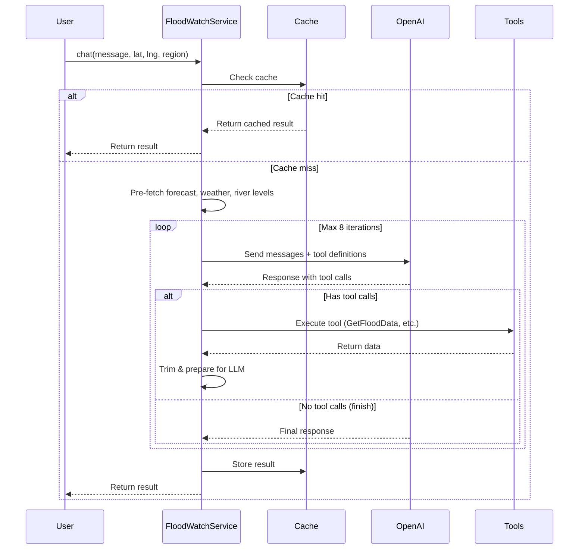

# LLM Integration Guide

**Purpose**: Comprehensive guide for understanding and optimizing the OpenAI LLM integration in FloodWatch.

**Last Updated**: 2026-02-11

---

## Table of Contents

- [Overview](#overview)
- [Architecture](#architecture)
- [Usage Patterns](#usage-patterns)
- [Optimization Strategies](#optimization-strategies)
- [Error Handling](#error-handling)
- [Token Management](#token-management)
- [Tool Calling](#tool-calling)
- [Caching Strategy](#caching-strategy)
- [Monitoring & Debugging](#monitoring--debugging)
- [Best Practices](#best-practices)
- [Troubleshooting](#troubleshooting)

---

## Overview

FloodWatch uses **OpenAI's function calling** (tool calling) to orchestrate data retrieval and synthesis. The LLM acts as an intelligent coordinator that:

1. Decides which data sources to query based on user input
2. Correlates flood warnings with road incidents
3. Synthesizes natural language summaries with actionable advice
4. Prioritizes "Danger to Life" alerts

**Key Component**: `FloodWatchService::chat()` - the main orchestration method

**LLM Provider**: OpenAI (via `openai-php/laravel`)

**Model**: Configurable via `config('openai.model')` - default is `gpt-4o-mini`

---

## Architecture

### Request Flow



### Components

| Component | Responsibility | Location |
|-----------|---------------|----------|
| **FloodWatchService** | Main orchestration, LLM loop | `app/Services/FloodWatchService.php` |
| **FloodWatchPromptBuilder** | System prompts, tool definitions | `app/Services/FloodWatchPromptBuilder.php` |
| **RiskCorrelationService** | Deterministic flood↔road correlation | `app/Services/RiskCorrelationService.php` |
| **Tool Executors** | Environment Agency, National Highways APIs | `app/Flood/Services/`, `app/Roads/Services/` |

---

## Usage Patterns

### Basic Usage

```php
use App\Services\FloodWatchService;

$service = app(FloodWatchService::class);

$result = $service->chat(
    userMessage: 'Check flood status for Bristol',
    userLat: 51.4545,
    userLng: -2.5879,
    region: 'bristol'
);

// $result contains:
// - response: LLM-generated summary
// - floods: Array of flood warnings
// - incidents: Array of road incidents
// - forecast: 5-day flood risk outlook
// - weather: 5-day weather forecast
// - riverLevels: River/sea monitoring data
// - lastChecked: ISO 8601 timestamp
```

### Multi-turn Conversations

```php
$conversation = [];

// First turn
$result = $service->chat(
    userMessage: 'What is the flood status?',
    conversation: $conversation
);

// Add assistant response to conversation
$conversation[] = [
    'role' => 'user',
    'content' => 'What is the flood status?'
];
$conversation[] = [
    'role' => 'assistant',
    'content' => $result['response']
];

// Second turn
$result = $service->chat(
    userMessage: 'What about road closures?',
    conversation: $conversation
);
```

### Progress Callbacks

```php
$service->chat(
    userMessage: 'Check status',
    onProgress: function (string $status) {
        // Called with progress updates:
        // - "Fetching forecast data..."
        // - "Checking flood warnings..."
        // - "Analyzing road status..."
        // - "Preparing summary..."
        
        // Use for UI updates (Livewire wire:loading)
        $this->dispatch('progress-update', status: $status);
    }
);
```

---

## Optimization Strategies

### 1. Token Usage Optimization

**Problem**: Large payloads increase cost and may exceed context limits (128k tokens).

**Solutions Implemented**:

| Strategy | Location | Savings |
|----------|----------|---------|
| **Polygon stripping** | `prepareToolResultForLlm()` | ~2-5k tokens per flood |
| **Message truncation** | `trimMessagesToTokenBudget()` | Keeps last assistant+tool block only |
| **Tool content limits** | Config: `llm_max_floods`, `llm_max_incidents` | Caps array sizes |
| **Forecast truncation** | `llm_max_forecast_chars` (1200) | Shortens England-wide text |
| **Flood message trimming** | `llm_max_flood_message_chars` (150) | Truncates verbose alerts |
| **Prompt caching** | `FloodWatchPromptBuilder` cache properties | Eliminates repeated file I/O |
| **Tool definition caching** | `FloodWatchPromptBuilder` cache properties | Eliminates repeated array construction |

**Monitoring**:
```php
// Check logs for token estimates
Log::info('FloodWatch OpenAI payload', [
    'size_bytes' => $payloadBytes,
    'estimated_tokens' => $estimatedTokens,  // bytes / 4
    'message_count' => count($messages),
]);
```

### 2. API Call Efficiency

**Parallel Pre-fetch**:
```php
// forecast, weather, riverLevels fetched in parallel
[$forecast, $weather, $riverLevels] = Concurrency::run([
    fn () => $forecastService->getForecast(),
    fn () => $weatherService->getForecast($lat, $lng),
    fn () => $riverLevelService->getLevels($lat, $lng),
]);
```

**Benefits**:
- Reduces total wait time from ~15s (sequential) to ~5s (parallel)
- Uses Laravel's `Concurrency` facade (backed by `sync` driver in tests, `process` in production)

**Configuration**:
```env
CONCURRENCY_DRIVER=process  # Use 'process' for true parallelism in production
```

### 3. Caching Strategy

**Cache Key Structure** (`FloodWatchService::cacheKey()`):
- When `$cacheKey` is provided (e.g. postcode or place name): `flood-watch:chat:{md5($cacheKey)}`
- When `$cacheKey` is null or empty: `flood-watch:chat:{md5($userMessage)}`

So the key is derived from the cache key **or** the user message, not both combined.

**TTL**: Default is **0** (caching disabled). Set `FLOOD_WATCH_CACHE_TTL_MINUTES=15` (or desired minutes) in `.env` to enable. Config: `config('flood-watch.cache_ttl_minutes')`.

**Cache Stores**:
- **Production**: Redis (`flood-watch` store)
- **Testing**: Array cache (`flood-watch-array` store)
- **Fallback**: Graceful degradation if Redis unavailable

**Pre-warming** (for common locations):
```bash
php artisan flood-watch:warm-cache
```

---

## Error Handling

### Exception Hierarchy

The service catches in order and returns an empty result with a user-facing message and optional `error_key` (so the dashboard can show the error and set `retryAfterTimestamp` for rate limits):

```php
try {
    $response = OpenAI::chat()->create($payload);
} catch (\OpenAI\Exceptions\RateLimitException $e) {
    Log::error('FloodWatch OpenAI rate limit', ['error' => $e->getMessage(), 'iteration' => $iteration + 1]);
    return $emptyResult(__('flood-watch.error.rate_limit'), now()->toIso8601String(), 'rate_limit');
} catch (\OpenAI\Exceptions\ErrorException $e) {
    Log::error('FloodWatch OpenAI API error', [
        'error' => $e->getMessage(),
        'status_code' => $e->getStatusCode(),
        'iteration' => $iteration + 1,
    ]);
    $status = $e->getStatusCode();
    $messageKey = match ($status) {
        429 => 'flood-watch.error.rate_limit',
        408, 504 => 'flood-watch.error.timeout',
        default => 'flood-watch.error.api_error',
    };
    $errorKey = match ($status) {
        429 => 'rate_limit',
        408, 504 => 'timeout',
        default => 'api_error',
    };
    return $emptyResult(__($messageKey), now()->toIso8601String(), $errorKey);
} catch (\OpenAI\Exceptions\TransporterException $e) {
    Log::error('FloodWatch OpenAI transport error', ['error' => $e->getMessage(), 'iteration' => $iteration + 1]);
    $msg = $this->userMessageForLlmException($e);
    $errorKey = $this->errorKeyFromMessage($msg);
    return $emptyResult($msg, now()->toIso8601String(), $errorKey);
} catch (Throwable $e) {
    Log::error('FloodWatch unexpected error during LLM call', ['error' => $e->getMessage(), 'iteration' => $iteration + 1]);
    $msg = $this->userMessageForLlmException($e);
    $errorKey = $this->errorKeyFromMessage($msg);
    return $emptyResult($msg, now()->toIso8601String(), $errorKey);
}
```

- **RateLimitException**: always → `rate_limit` message and `error_key`.
- **ErrorException**: 429 → rate_limit, 408/504 → timeout, else → api_error (auth, model unavailable, etc.).
- **TransporterException** / **Throwable**: `userMessageForLlmException($e)` maps by message (rate limit, timeout, connection keywords) to the right lang key; `errorKeyFromMessage()` yields the `error_key` for the dashboard.
- `$emptyResult($response, $lastChecked, $errorKey)` when `$errorKey` is set adds `'error' => true` and `'error_key' => $errorKey` to the returned array so the Livewire dashboard can set `$this->error` and `retryAfterTimestamp` when the service returns instead of throwing.

### Tool Execution Errors

```php
try {
    $result = $this->executeTool($toolName, $args, $context);
} catch (Throwable $e) {
    Log::warning('FloodWatch tool execution failed', [
        'tool' => $toolName,
        'error' => $e->getMessage(),
    ]);
    // Generic message to LLM only; detailed message stays in logs to avoid leaking internals
    $result = ['error' => __('flood-watch.error.tool_failed'), 'code' => 'tool_error'];
}
```

**Behavior**: LLM receives error message and can decide to:
- Inform the user data is unavailable
- Try alternative tools
- Continue with partial data

### Graceful Degradation

**Empty Result Structure** (returned on API/transport errors or when no API key):

Always present: `response`, `floods`, `incidents`, `forecast`, `weather`, `riverLevels`, `lastChecked`.

When the failure is an LLM/transport error (rate limit, timeout, connection, api_error, unexpected), the array also includes:

- **`error`** (bool): `true` — indicates this is an error response; callers should treat `response` as a user-facing error message and may show it in an error state (e.g. Livewire `$this->error`).
- **`error_key`** (string): one of `rate_limit`, `timeout`, `connection`, `api_error`, `unexpected` — allows callers to branch (e.g. set `retryAfterTimestamp` only when `error_key === 'rate_limit'`).

```php
// Success or non-exception empty result (e.g. no API key)
[
    'response' => '…',
    'floods' => [],
    'incidents' => [],
    'forecast' => [],
    'weather' => [],
    'riverLevels' => [],
    'lastChecked' => '2026-02-11T08:00:00Z',
]

// Error response (LLM/transport failure)
[
    'response' => 'AI service rate limit exceeded. Please wait a minute and try again.',
    'floods' => [],
    'incidents' => [],
    'forecast' => [],
    'weather' => [],
    'riverLevels' => [],
    'lastChecked' => '2026-02-11T08:00:00Z',
    'error' => true,
    'error_key' => 'rate_limit',
]
```

**Callers**: Check `!empty($result['error'])` to detect an error return; use `$result['response']` for the message and `$result['error_key']` for retry/UX logic.

---

## Token Management

### Context Budget

**Model Limit**: 128,000 tokens (for `gpt-4o-mini` and `gpt-4o`)

**Configured Limit**: 110,000 tokens (safety margin)

**Token Estimation**: `bytes / 4` (OpenAI's rule of thumb: 1 token ≈ 4 characters)

### Trimming Algorithm

**Phase 1: Message History Trimming**

When over budget, keep only:
1. System prompt (index 0)
2. User message (index 1)
3. Last assistant message + its tool responses

```php
$messages = [
    $messages[0],  // System prompt
    $messages[1],  // User message
    ...array_slice($messages, $lastAssistantIndex),  // Last assistant+tools
];
```

**Phase 2: Tool Content Truncation**

If still over budget, progressively shorten tool response contents:

```php
$maxContentChars = 8000;  // Start
while (estimatedTokens > maxTokens && $maxContentChars > 500) {
    // Truncate all tool contents to $maxContentChars
    $maxContentChars -= 2000;  // Reduce by 2k each iteration
}
```

### Configuration

Adjust limits via environment variables:

```env
FLOOD_WATCH_LLM_MAX_FLOODS=12
FLOOD_WATCH_LLM_MAX_INCIDENTS=12
FLOOD_WATCH_LLM_MAX_RIVER_LEVELS=8
FLOOD_WATCH_LLM_MAX_FORECAST_CHARS=1200
FLOOD_WATCH_LLM_MAX_FLOOD_MESSAGE_CHARS=150
FLOOD_WATCH_LLM_MAX_CONTEXT_TOKENS=110000
FLOOD_WATCH_LLM_MAX_CORRELATION_CHARS=8000
```

---

## Tool Calling

### Available Tools

| Tool | Purpose | Parameters | Data Source |
|------|---------|------------|-------------|
| **GetFloodData** | Fetch flood warnings | `lat`, `lng`, `radius_km` | Environment Agency |
| **GetHighwaysIncidents** | Fetch road closures | None (region-filtered) | National Highways |
| **GetFloodForecast** | 5-day flood outlook | None | Flood Forecasting Centre |
| **GetRiverLevels** | River/sea monitoring | `lat`, `lng`, `radius_km` | Environment Agency |
| **GetCorrelationSummary** | Deterministic correlation | None | RiskCorrelationService |

### Tool Definition Example

```php
[
    'type' => 'function',
    'function' => [
        'name' => 'GetFloodData',
        'description' => 'Fetch current flood warnings from the Environment Agency...',
        'parameters' => [
            'type' => 'object',
            'properties' => [
                'lat' => ['type' => 'number', 'description' => 'Latitude'],
                'lng' => ['type' => 'number', 'description' => 'Longitude'],
                'radius_km' => ['type' => 'integer', 'description' => 'Search radius'],
            ],
        ],
    ],
]
```

### Tool Execution Flow

1. **LLM decides** which tools to call based on system prompt and user message
2. **FloodWatchService** receives tool calls in OpenAI response
3. **executeTool()** dispatches to appropriate service
4. **prepareToolResultForLlm()** trims and formats result
5. **Result sent back** to LLM in next iteration

### LLM-Driven vs Pre-fetched

| Data | When Fetched | Why |
|------|--------------|-----|
| Forecast | Pre-fetched | Always needed for context |
| Weather | Pre-fetched | Displayed on dashboard |
| River Levels | Pre-fetched | Needed for correlation |
| Flood Warnings | LLM-driven | Only if LLM calls GetFloodData |
| Road Incidents | LLM-driven | Only if LLM calls GetHighwaysIncidents |

**Note**: Pre-fetched data is returned in final result even if LLM never calls the tool.

---

## Caching Strategy

### Cache Layers

**1. Result Cache** (15-minute TTL):
- Entire `chat()` result
- Key: `flood-watch:chat:{hash}`
- Store: Redis or array

**2. Prompt Cache** (in-memory):
- Base system prompt
- Tool definitions
- Lifetime: Request scope

**3. API Response Cache** (external services):
- Environment Agency data: 5 minutes
- National Highways: 5 minutes
- Flood Forecast: 60 minutes
- Weather: 60 minutes

### Cache Warming

```bash
# Warm cache for common locations
php artisan flood-watch:warm-cache

# Schedule in routes/console.php
Schedule::command('flood-watch:warm-cache')
    ->everyFifteenMinutes();
```

**Locations Warmed**:
- Default (Langport): 51.0358, -2.8318
- Region-specific locations from `config/flood-watch.warm_cache_locations`

---

## Monitoring & Debugging

### Logging Levels

**INFO** - Performance metrics:
```php
Log::info('FloodWatch OpenAI payload', [
    'size_bytes' => 12345,
    'estimated_tokens' => 3086,
    'message_count' => 5,
    'iteration' => 2,
]);
```

**DEBUG** - Full payload (masked):
```php
Log::debug('FloodWatch OpenAI payload content', [
    'payload' => LogMasker::maskOpenAiPayload($payload),
]);
```

**WARNING** - Token budget issues:
```php
Log::warning('FloodWatch trimmed to last assistant+tool block', [
    'estimated_tokens' => 95000,
]);
```

**ERROR** - API failures:
```php
Log::error('FloodWatch OpenAI API error', [
    'error' => 'Rate limit exceeded',
    'iteration' => 3,
]);
```

### Cost Tracking

**Admin Dashboard**: `/admin/dashboard`

Shows:
- Total requests (current month)
- Token usage (input + output)
- Estimated cost (based on `gpt-4o-mini` pricing)
- Budget remaining

**Configuration**:
```env
FLOOD_WATCH_LLM_COST_INPUT_PER_M=0.15   # $0.15 per 1M tokens
FLOOD_WATCH_LLM_COST_OUTPUT_PER_M=0.60  # $0.60 per 1M tokens
FLOOD_WATCH_LLM_BUDGET_MONTHLY=10       # $10/month
```

### Debugging Checklist

1. **Check logs**: `storage/logs/laravel.log`
2. **Verify API key**: `OPENAI_API_KEY` in `.env`
3. **Test external APIs**: Health endpoint (`/health`)
4. **Cache inspection**: Redis CLI (`redis-cli KEYS flood-watch:*`)
5. **Token estimation**: Look for "estimated_tokens" in logs

---

## Best Practices

### 1. System Prompt Design

✅ **DO**:
- Keep instructions concise and actionable
- Use region-specific guidance for context
- Specify output format (Current Status, Action Steps)
- Prioritize by severity (Danger to Life → road closures → alerts)

❌ **DON'T**:
- Include examples in tool descriptions (bloats tokens)
- Use vague language ("maybe", "might", "could")
- Repeat information across tools

### 2. Tool Calling

✅ **DO**:
- Let the LLM decide which tools to call
- Provide clear, descriptive tool names
- Include default values in parameter descriptions
- Return structured data (arrays, not text)

❌ **DON'T**:
- Force tool calls with `tool_choice: required`
- Return massive arrays (use limits)
- Include unnecessary metadata in responses

### 3. Error Handling

✅ **DO**:
- Catch OpenAI-specific exceptions separately
- Log errors with context (tool name, iteration)
- Return partial results when possible
- Provide user-friendly error messages

❌ **DON'T**:
- Swallow exceptions silently
- Expose API keys or sensitive data in logs
- Return generic "Something went wrong" messages

### 4. Performance

✅ **DO**:
- Use parallel pre-fetch for independent data
- Cache prompts and tool definitions
- Set appropriate TTLs for data freshness
- Warm cache for common locations

❌ **DON'T**:
- Make sequential API calls for parallel-safe data
- Re-read files or rebuild arrays on every request
- Cache forever (data becomes stale)
- Fetch data not needed by the user

---

## Troubleshooting

### "Context length exceeded" error

**Symptom**: `OpenAI\Exceptions\ErrorException: This model's maximum context length is 128000 tokens.`

**Causes**:
1. Too many floods/incidents returned
2. Verbose tool responses
3. Long conversation history

**Solutions**:
1. Reduce `llm_max_floods`, `llm_max_incidents` in config
2. Shorten `llm_max_forecast_chars`, `llm_max_flood_message_chars`
3. Clear conversation history (multi-turn chat)
4. Check logs for "estimated_tokens" before error

### "Rate limit exceeded" error

**Symptom**: `OpenAI\Exceptions\ErrorException: Rate limit reached for requests`

**Causes**:
1. Too many requests per minute (RPM)
2. Too many tokens per minute (TPM)
3. Concurrent users hammering the API

**Solutions**:
1. Increase cache TTL to reduce API calls
2. Enable cache pre-warming
3. Add rate limiting middleware (`ThrottleFloodWatch`)
4. Upgrade OpenAI tier for higher limits

### LLM returns empty response

**Symptom**: `response: "No content available"`

**Causes**:
1. No API key configured
2. OpenAI API down
3. All tools returned errors
4. Max iterations reached (8)

**Solutions**:
1. Check `OPENAI_API_KEY` in `.env`
2. Verify OpenAI status: https://status.openai.com/
3. Check tool execution logs
4. Increase `$maxIterations` if needed (rare)

### Tools not being called

**Symptom**: LLM returns generic response without fetching data

**Causes**:
1. System prompt doesn't encourage tool use
2. User message too vague
3. Tool descriptions unclear
4. LLM thinks it already has the data

**Solutions**:
1. Add "Use GetFloodData to fetch current warnings" to system prompt
2. Ask specific questions ("What flood warnings are active?")
3. Clarify tool descriptions
4. Clear cache to reset context

### High token usage / cost

**Symptom**: Token usage or cost higher than expected

**Causes**:
1. Verbose tool responses
2. Long flood warning messages
3. Too many items in arrays
4. Large correlation summaries

**Solutions**:
1. Reduce all `llm_max_*` config values by 50%
2. Check logs for largest payloads (`size_bytes`)
3. Profile tools: which ones return most data?
4. Use cheaper model: `gpt-4o-mini` instead of `gpt-4o`

### Cache not working

**Symptom**: Every request hits OpenAI API (check logs)

**Causes**:
1. Cache TTL = 0 (disabled)
2. Redis unavailable
3. Different cache keys each time
4. Cache store misconfigured

**Solutions**:
1. Set `FLOOD_WATCH_CACHE_TTL_MINUTES=15`
2. Check Redis: `redis-cli PING`
3. Use consistent `$cacheKey` parameter
4. Verify `FLOOD_WATCH_CACHE_STORE=flood-watch` in `.env`

---

## Additional Resources

- **OpenAI Function Calling**: https://platform.openai.com/docs/guides/function-calling
- **Laravel Concurrency**: https://laravel.com/docs/12.x/concurrency
- **Cost Calculator**: https://openai.com/pricing
- **FloodWatch Docs**:
  - [LLM Data Flow](LLM_DATA_FLOW.md)
  - [Architecture](ARCHITECTURE.md)
  - [Risk Correlation](RISK_CORRELATION.md)
  - [Performance](PERFORMANCE.md)

---

**Questions or Issues?**
- GitHub Issues: https://github.com/iammikek/floodwatch/issues
- Update this guide if you discover new patterns or solutions
