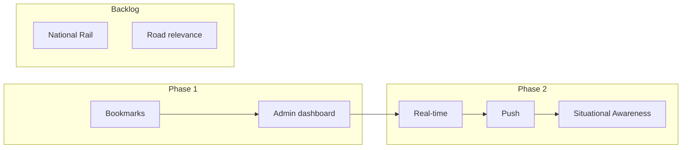

# Flood Watch – Development Plan

**Ref**: `docs/BRIEF.md`  
**Date**: 2026-02-05

Single development plan consolidating roadmap, backlog, data sources, and implementation notes.

---

## Current State

- **LLM tools**: GetFloodData, GetHighwaysIncidents, GetFloodForecast, GetRiverLevels
- **Regions**: Somerset (BA, TA), Bristol (BS), Devon (EX, TQ, PL), Cornwall (TR)
- **Resilience**: Circuit breaker, retry, Redis cache, graceful degradation
- **Dashboard**: Flood warnings, road status, map, 5-day forecast, weather
- **Tooling**: Yarn, CI via `.github/workflows/tests.yml`

---

## Phase 1: MVP (Current Focus)

| Item | Status | Notes |
|------|--------|-------|
| Location bookmarks | Planned | Multiple locations per registered user; profile default |
| Profile default location | Planned | Pre-loaded on open; feeds admin metrics |
| Admin dashboard | Planned | API health, LLM cost, user metrics |
| Danger to life | Done | Emergency numbers + instructions in prompt |
| Registration flow | Done | Rate limit guests; unlimited for registered |

---

## Phase 2: Situational Awareness (Registered Users)

**Vision**: Operational dashboard that auto-refreshes every 15 min; no need to re-run searches.

| Feature | Approach |
|---------|----------|
| **Risk gauge** | 0–100 index from floods, incidents, river levels, forecast |
| **Status grid** | Hydrological, infrastructure, weather, AI advisory |
| **Activity feed** | Live events (new warning, road opened/closed); Laravel Reverb |
| **Push notifications** | Web Push + FCM for high-severity, location-relevant events |
| **Backend polling** | Job every 15 min; delta comparison; emit events on change |

**Cost**: Gate behind auth; AI tokens and background jobs incur higher spend.

---

## Roadmap

---

## Backlog (by Priority)

| Priority | Item | Notes |
|----------|------|-------|
| High | Location bookmarks + profile default | Model, migration, UI |
| High | Search history (DB) | Store searched locations; schema below |
| High | Use my location (GPS) | Browser geolocation; "Use my location" button in UI |
| High | Admin dashboard | API health, LLM cost, user metrics |
| High | National Rail | LDB API, GetRailDisruption tool, Rail Status section |
| Medium | Road data relevance | Filter flood-related; cascading prompt |
| Medium | Expand predictive rules | Curry Moor, Salt Moor, Thorney, Devon cut-off |
| Medium | Analytics layer | Event storage, reporting, admin reports; see below |
| Medium | Real-time & push | Laravel Reverb + FCM; see Phase 2 |
| Medium | Queue-based async | For high-traffic; poll for results |
| Low | Polygon limit tuning | `max_polygons_per_request` |
| Low | Additional regions | Beyond South West; see `docs/CONSIDERATIONS.md` |
| Low | Test coverage visibility | Document critical paths; consider `--coverage` in CI |
| Low | Postcode sector cache key | Use sector (TA10 0) not full (TA10 0DP) for cache; reduces cost |
| Low | Cache warming | Schedule `flood-watch:warm-cache`; region-based locations; see below |
| Low | Donations | "Support Flood Watch" link in footer; Ko-fi / PayPal / Buy Me a Coffee |

---

## Donations (Plan)

Users support the project via **donations**. The app stays free; donations offset API and hosting costs.

| Element | Placement |
|---------|-----------|
| **Footer** | "Support Flood Watch" link |
| **Profile** | "Support this project" (optional) |
| **Platform** | Ko-fi, Buy Me a Coffee, or PayPal – external link |

**Approach**: Soft ask, non-intrusive. No in-app payment processing; link to external donation page.

**Ref**: `docs/archive/MONETISATION_PLAN.md` for platform comparison.

---

## Cache Warming (Plan)

Use scheduled cache warming to improve first-request latency and reduce cold-cache misses.

**Approach**:

1. **Config**: Add `flood-watch.warm_cache_locations` – one representative location per region (e.g. Langport, Bristol, Exeter, Truro).
2. **Command**: Extend `flood-watch:warm-cache` with `--regions=` option; resolve each location via `LocationResolver`; pass lat, long, region to `chat()`.
3. **Schedule**: Run every 15 min in `routes/console.php` (align with cache TTL).
4. **Region-scoping**: Warm by region so Somerset users hit Somerset cache; no cross-region pollution.

**Effort**: ~1 sprint.

---

## Search History (Database) – Plan

Store locations users have searched in a database for quick re-search, analytics, and admin metrics.

**Schema**: See **`docs/SCHEMA.md`** – `user_searches` table (user_id nullable, session_id for guests, lat, long, region, searched_at).

- **Guests**: Store with `user_id = null`, `session_id` for deduplication; retention e.g. 90 days
- **Registered**: Associate with `user_id`; show "Recent searches" in UI (dropdown or quick-pick)
- **Admin**: Top regions, top postcodes, search volume over time

**Effort**: ~1 sprint.

---

## Use My Location (GPS) – Plan

Allow users to use phone GPS for instant location lookup.

**Approach**:

1. **UI**: "Use my location" button/link next to the location input (mobile + desktop).
2. **Browser API**: `navigator.geolocation.getCurrentPosition()` – requires HTTPS (Railway provides).
3. **Flow**: User taps → browser prompts for permission → get lat/long → reverse-geocode to postcode/place name for display, or use coords directly for search.
4. **Fallback**: If denied or error, show message: "Could not get location. Try entering a postcode."
5. **Display**: Show "📍 Current location" or resolved place name (e.g. "Near Langport").

**Effort**: ~0.5 sprint.

---

## Analytics Layer (Plan)

Build an **analytics layer** to support reporting and operational insights.

**Purpose**:
- Admin reports: search volume, top regions/postcodes, user growth
- Operational: API usage, cache hit rate, LLM cost trends, error rates
- Regional: flood/incident counts over time, correlation with search spikes

**Data sources**:
- `user_searches` – location, region, searched_at (already planned)
- **Analytics events** (optional): API calls, cache hits, errors, LLM tokens – if more granular reporting needed
- **API snapshots** (optional): Periodic flood/incident counts by region for historical trend charts

**Reporting outputs**:
- Admin dashboard: time-series charts (searches/day, cost/day), top regions, top postcodes
- Export: CSV for external analysis
- Alerts: e.g. budget threshold, error spike

**Storage**: Database tables for events/snapshots; aggregate views or scheduled jobs for reports. Laravel Pulse may cover some metrics; custom tables for business-specific analytics.

**Effort**: ~1–2 sprints depending on scope.

---

## Data Sources

**Current**: Environment Agency, National Highways, Flood Forecast, Open-Meteo

**Planned**: National Rail (LDB/Darwin via raildata.org.uk) – departures/delays for South West stations

---

## Real-time & Push (Cost)

| Feature | Approach | Railway cost |
|---------|----------|--------------|
| WebSockets | Laravel Reverb | Included in compute |
| Push | Web Push + FCM | Free |

Reverb as second service or process; Redis if scaling. Alternative: Pusher (free tier: 200k msg/day).

---

## Reference

| Doc | Purpose |
|-----|---------|
| `docs/BRIEF.md` | Product brief |
| `docs/ACCEPTANCE_CRITERIA.md` | Success checklist |
| `docs/WIREFRAMES.md` | UI wireframes |
| `docs/ARCHITECTURE.md` | System structure, data flow |
| `docs/LLM_DATA_FLOW.md` | How LLM consumes data |
| `docs/DEPLOYMENT.md` | Railway runbook, pre-launch checklist |
| `docs/TROUBLESHOOTING.md` | LLM timeout, circuit breaker, cache |
| `docs/CONSIDERATIONS.md` | Risks, API dependency, regional scope, costs |
| `docs/DATA_SOURCES.md` | Current + planned APIs; National Rail implementation plan |
| `docs/NEXT_STEPS.md` | Success metrics, extended next steps |
| `docs/SCHEMA.md` | Database schema, object map, entity relationships |
