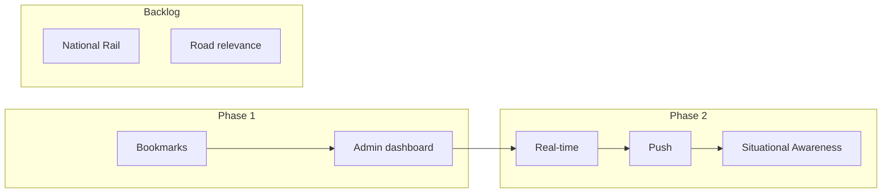

# Flood Watch – Development Plan

**Ref**: `docs/BRIEF.md`  
**Date**: 2026-02-05

Single development plan consolidating roadmap, backlog, data sources, and implementation notes.

---

## Current State

- **LLM tools**: GetFloodData, GetHighwaysIncidents, GetFloodForecast, GetRiverLevels
- **Regions**: Somerset (BA, TA), Bristol (BS), Devon (EX, TQ, PL), Cornwall (TR)
- **Resilience**: Circuit breaker, retry, Redis cache, graceful degradation
- **Dashboard**: Flood warnings, road status, map, 5-day forecast, weather
- **Tooling**: Yarn, CI via `.github/workflows/tests.yml`

---

## Phase 1: MVP (Current Focus)

| Item | Status | Notes |
|------|--------|-------|
| Location bookmarks | Planned | Multiple locations per registered user; profile default |
| Profile default location | Planned | Pre-loaded on open; feeds admin metrics |
| Admin dashboard | Planned | API health, LLM cost, user metrics |
| Danger to life | Done | Emergency numbers + instructions in prompt |
| Registration flow | Done | Rate limit guests; unlimited for registered |

---

## Phase 2: Situational Awareness (Registered Users)

**Vision**: Operational dashboard that auto-refreshes every 15 min; no need to re-run searches.

| Feature | Approach |
|---------|----------|
| **Risk gauge** | 0–100 index from floods, incidents, river levels, forecast |
| **Status grid** | Hydrological, infrastructure, weather, AI advisory |
| **Activity feed** | Live events (new warning, road opened/closed); Laravel Reverb |
| **Push notifications** | Web Push + FCM for high-severity, location-relevant events |
| **Backend polling** | Job every 15 min; delta comparison; emit events on change |

**Cost**: Gate behind auth; AI tokens and background jobs incur higher spend.

---

## Roadmap

---

## Backlog (by Priority)

| Priority | Item | Notes |
|----------|------|-------|
| High | Location bookmarks + profile default | Model, migration, UI |
| High | Admin dashboard | API health, LLM cost, user metrics |
| High | National Rail | LDB API, GetRailDisruption tool, Rail Status section |
| Medium | Road data relevance | Filter flood-related; cascading prompt |
| Medium | Expand predictive rules | Curry Moor, Salt Moor, Thorney, Devon cut-off |
| Medium | Real-time & push | Laravel Reverb + FCM; see Phase 2 |
| Medium | Queue-based async | For high-traffic; poll for results |
| Low | Polygon limit tuning | `max_polygons_per_request` |
| Low | Additional regions | Beyond South West |

---

## Data Sources

**Current**: Environment Agency, National Highways, Flood Forecast, Open-Meteo

**Planned**: National Rail (LDB/Darwin via raildata.org.uk) – departures/delays for South West stations

---

## Real-time & Push (Cost)

| Feature | Approach | Railway cost |
|---------|----------|--------------|
| WebSockets | Laravel Reverb | Included in compute |
| Push | Web Push + FCM | Free |

Reverb as second service or process; Redis if scaling. Alternative: Pusher (free tier: 200k msg/day).

---

## Reference

| Doc | Purpose |
|-----|---------|
| `docs/BRIEF.md` | Product brief |
| `docs/ACCEPTANCE_CRITERIA.md` | Success checklist |
| `docs/WIREFRAMES.md` | UI wireframes |
| `docs/ARCHITECTURE.md` | System structure, data flow |
| `docs/LLM_DATA_FLOW.md` | How LLM consumes data |
| `docs/DEPLOYMENT.md` | Railway runbook |
