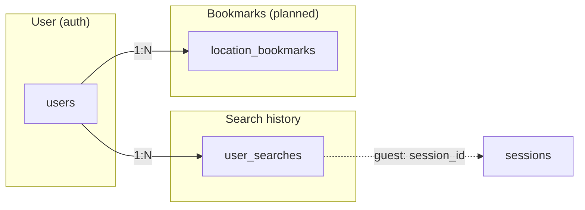

# Flood Watch – Data Schema

**Ref**: `docs/BRIEF.md`, `docs/PLAN.md`

Schema and object map for Flood Watch database tables.

---

## Object Map

```mermaid
erDiagram
    users ||--o{ user_searches : "has"
    users ||--o{ location_bookmarks : "has"
    users {
        bigint id PK
        string name
        string email
        string role
        timestamp email_verified_at
        string password
        string remember_token
        timestamps created_at updated_at
    }
    user_searches {
        bigint id PK
        bigint user_id FK "nullable"
        string session_id "nullable"
        string location
        float lat
        float lng
        string region "nullable"
        timestamp searched_at
        timestamps created_at updated_at
    }
    location_bookmarks {
        bigint id PK
        bigint user_id FK
        string label
        string location
        float lat
        float lng
        string region "nullable"
        boolean is_default
        timestamps created_at updated_at
    }
    sessions {
        string id PK
        bigint user_id FK "nullable"
        string ip_address
        text user_agent
        longtext payload
        integer last_activity
    }
    users ||--o{ sessions : "has"
```

---

## Existing Tables

### users

| Column | Type | Notes |
|--------|------|-------|
| id | bigint PK | |
| name | string | |
| email | string unique | |
| role | string | default 'user' |
| email_verified_at | timestamp nullable | |
| password | string | |
| remember_token | string nullable | |
| created_at | timestamp | |
| updated_at | timestamp | |

### sessions

| Column | Type | Notes |
|--------|------|-------|
| id | string PK | |
| user_id | bigint FK nullable | |
| ip_address | string nullable | |
| user_agent | text nullable | |
| payload | longtext | |
| last_activity | integer | |

---

## Planned Tables

### user_searches

Stores locations users have searched. Guests: `user_id = null`, `session_id` set. Registered: `user_id` set. Feeds "Recent searches" UI and admin metrics.

| Column | Type | Notes |
|--------|------|-------|
| id | bigint PK | |
| user_id | bigint FK nullable | References users.id |
| session_id | string nullable | For guests; deduplication |
| location | string | Postcode, place name, or "Current location" |
| lat | float | Resolved latitude |
| lng | float | Resolved longitude |
| region | string nullable | somerset, bristol, devon, cornwall |
| searched_at | timestamp | When the search ran |
| created_at | timestamp | |
| updated_at | timestamp | |

**Indexes**: `user_id`, `session_id`, `searched_at` (for retention/cleanup), `region` (for admin top-regions aggregation), `(user_id, searched_at)` and `(session_id, searched_at)` (for recent-searches filter+sort).

**Retention**: e.g. 90 days; prune older rows via scheduled job.

---

### location_bookmarks

Registered users can bookmark multiple locations (home, work, parents). One per user can be the default (pre-loaded on app open).

| Column | Type | Notes |
|--------|------|-------|
| id | bigint PK | |
| user_id | bigint FK | References users.id |
| label | string | e.g. "Home", "Work", "Parents" |
| location | string | Postcode or place name |
| lat | float | Resolved latitude |
| lng | float | Resolved longitude |
| region | string nullable | somerset, bristol, devon, cornwall |
| is_default | boolean | default false; one per user |
| created_at | timestamp | |
| updated_at | timestamp | |

**Indexes**: `user_id`, unique `(user_id, is_default)` where is_default = true.

---

## Analytics (Planned)

Tables to support the analytics layer (see `docs/PLAN.md`):

| Table | Purpose |
|-------|---------|
| `user_searches` | Primary source – search volume, top regions/postcodes, time-series |
| `analytics_events` | Optional – API calls, cache hits, errors, LLM tokens for granular reporting |
| `api_snapshots` | Optional – Periodic flood/incident counts by region for historical charts |

**analytics_events** (draft): `id`, `event_type` (search, api_call, cache_hit, error, llm_call), `payload` (JSON), `created_at`. Indexed by `event_type`, `created_at`.

**api_snapshots** (draft): `id`, `snapshot_type` (floods, incidents), `region`, `count`, `snapshot_at`. For trend charts (e.g. "flood warnings by region over last 7 days").

---

## Entity Relationships



---

## Reference

| Doc | Purpose |
|-----|---------|
| `docs/ARCHITECTURE.md` | System structure, data flow |
| `docs/PLAN.md` | Search history, bookmarks implementation plan |
| `docs/BRIEF.md` | User needs, persistence requirements |
| `docs/DATA_RETENTION.md` | Retention policies, pruning, future tasks |
