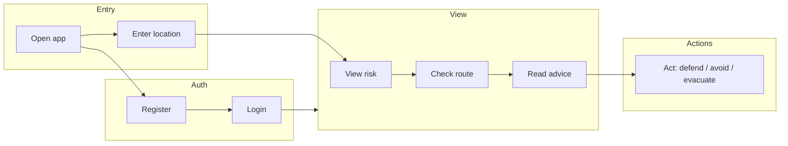

# Wireframe – Revised Brief (Mobile + Desktop)

**Ref**: `docs/BRIEF.md`  
**Date**: 2026-02-05

---

## User Journey



---

## Registration Flow

```
┌─────────────────────────────────────────────────────────────────────────────┐
│  Flood Watch                                                         [Login] │
├─────────────────────────────────────────────────────────────────────────────┤
│                                                                             │
│              Register to get more searches.                                 │
│                                                                             │
│              Name         [________________]                                 │
│              Email        [________________]                                 │
│              Password     [________________]                                 │
│              Confirm      [________________]                                 │
│                                                                             │
│              Already registered?  [Register]                                 │
│                                                                             │
└─────────────────────────────────────────────────────────────────────────────┘
```

**Outcome**: User can log in; profile created with default location (empty until set).

---

## Mobile (Condensed)

**Guest**:
```
┌─────────────────────────────────┐
│ Flood Watch    [Login] [Register]│
├─────────────────────────────────┤
│ 📍 Langport · TA10 9            │
│    [Change location]            │
```

**Logged in**:
```
┌─────────────────────────────────┐
│ Flood Watch      [Langport ▼] [👤]│
├─────────────────────────────────┤
│ 📍 Langport · TA10 9 (default)  │
│    [Change] [Profile]           │
├─────────────────────────────────┤
│ ⚠ YOUR RISK                     │
│   House: At risk – deploy       │
│   defences if forecast worsens  │
│   Roads: A361 closed · avoid    │
├─────────────────────────────────┤
│ 🚨 ACTION STEPS                 │
│   • Deploy defences if you have │
│   • Do not drive – routes at    │
│     risk                        │
│   • Monitor EA updates          │
│                                 │
│ (When Danger to Life:)          │
│ 🆘 EMERGENCY                    │
│   • Call 999 if life at risk   │
│   • Floodline: 0345 988 1188   │
│   • Move to higher ground now  │
├─────────────────────────────────┤
│ 🛣 ROUTE CHECK                  │
│   From [Langport]               │
│   To   [________]               │
│   [Check route]                 │
├─────────────────────────────────┤
│ 2 flood warnings · 1 road closed│
│ Last updated: 2:45 pm           │
└─────────────────────────────────┘
```

**Key elements**:
- Location at top with persistence; **registered users**: dropdown of bookmarked locations (home, work, etc.)
- Clear risk statement (house + roads)
- Action steps (Stay/Avoid/Flee)
- Route check (From/To)
- Minimal scroll; scannable
- **No map** – map may be omitted on mobile if too heavy (tiles, payload) and screen is small; prioritise text and cached state

---

## Desktop (Enhanced)

**Guest**:
```
┌────────────────────────────────────────────────────────────────────────────┐
│ Flood Watch               📍 Langport · TA10 9    [Login] [Register]      │
```

**Logged in**:
```
┌────────────────────────────────────────────────────────────────────────────┐
│ Flood Watch        [Langport ▼] 📍 TA10 9    [Change] [Refresh]    [👤]     │
├────────────────────────────────────────────────────────────────────────────┤
│ ┌─ Risk ─────────────────┐ ┌─ Route Check ────────────────────────────────┐│
│ │ House: At risk         │ │ From [Langport    ] To [Taunton    ] [Check]  ││
│ │ Roads: A361 closed     │ │                                                 ││
│ │ Deploy defences if you │ │ Route: BLOCKED at A361 East Lyng               ││
│ │ have them.             │ │ Alternative: M5 J25 → A358 → Taunton          ││
│ └────────────────────────┘ └───────────────────────────────────────────────┘│
├────────────────────────────────────────────────────────────────────────────┤
│ ┌─ Map ──────────────────────────────────────┐ ┌─ Flood Warnings ────────┐ │
│ │                                            │ │ • North Moor – Severe   │ │
│ │   [Leaflet map: floods, roads, gauges]     │ │ • King's Sedgemoor      │ │
│ │                                            │ │ • Muchelney at risk     │ │
│ └────────────────────────────────────────────┘ └─────────────────────────┘ │
├────────────────────────────────────────────────────────────────────────────┤
│ Road Status · Forecast · River Levels · Attribution                        │
└────────────────────────────────────────────────────────────────────────────┘
```

**Key elements**:
- Risk summary + Route check side by side
- Map with full context
- Flood and road lists
- Forecast, river levels, attribution

---

## Route Check Result (shared)

| Outcome | Display |
|---------|---------|
| **Clear** | "Route appears clear. Check conditions before you travel." |
| **Blocked** | "A361 closed at East Lyng. Alternative: M5 → A358." |
| **At risk** | "Route crosses flood warning area. Do not drive if water on road." |
| **Delays** | "Lane closures M5 J24–23. Expect delays." |

## Danger to Life (Severe Flood Warning)

When severe flood warnings (danger to life) are detected, prominently display:

| Element | Content |
|---------|---------|
| **Emergency numbers** | 999 (life at risk) · Floodline 0345 988 1188 (24/7 flood advice) |
| **Instructions** | Evacuate if advised · Move to higher ground · Do not enter floodwater · Call 999 if life at risk |

Show in Action Steps or a dedicated "Emergency" block when `severityLevel === 1` (Severe).

---

## Location Input (shared)

- Postcode: `TA10 9`
- Address: `High Street, Langport`
- What3Words: `///word.word.word`

All produce coordinates; UI remembers last used.

---

## Profile (Logged-in Users)

```
┌─────────────────────────────────────────────────────────────────────────────┐
│  Profile                                                                     │
├─────────────────────────────────────────────────────────────────────────────┤
│  Profile Information                                                         │
│  ┌─────────────────────────────────────────────────────────────────────┐   │
│  │  Name     [Jane Smith          ]                                     │   │
│  │  Email    [jane@example.com    ]                                     │   │
│  └─────────────────────────────────────────────────────────────────────┘   │
│                                                                             │
│  Default Location (used when you open the app)                               │
│  ┌─────────────────────────────────────────────────────────────────────┐   │
│  │  [Langport · TA10 9                    ]  [Set as default]            │   │
│  │  Or choose from bookmarks: [Home ▼] [Work] [Parents]                 │   │
│  └─────────────────────────────────────────────────────────────────────┘   │
│                                                                             │
│  Update Password · Delete Account                                           │
└─────────────────────────────────────────────────────────────────────────────┘
```

- **Default location**: Stored in profile; pre-loaded on app open. Enables user metrics (regions, postcodes) for admin dashboard.
- **Bookmarks**: Same locations as location dropdown; can set any as default.

---

## Admin Dashboard (`/admin-dashboard`)

Admin-only view for user metrics, API health, and LLM cost.

```
┌─────────────────────────────────────────────────────────────────────────────┐
│  Flood Watch Admin                                                    [👤]   │
├─────────────────────────────────────────────────────────────────────────────┤
│  API Health                                                                  │
│  ┌────────────────────┬─────────┬─────────────────────────────────────────┐│
│  │ Environment Agency  │ ✓ ok    │                                         ││
│  │ Flood Forecast      │ ✓ ok    │                                         ││
│  │ Weather (Open-Meteo)│ ✓ ok    │                                         ││
│  │ National Highways   │ ✓ ok    │ (or ⚠ skipped if no API key)             ││
│  │ Cache               │ ✓ ok    │                                         ││
│  └────────────────────┴─────────┴─────────────────────────────────────────┘│
│                                                                             │
│  LLM Cost (OpenAI)                                                           │
│  ┌──────────────┬──────────────┬──────────────┬──────────────────────────┐  │
│  │ Today        │ This month   │ Est. spend   │ Last updated             │  │
│  │ 23 requests  │ 412 requests │ $4.12        │ 2:45 pm                  │  │
│  └──────────────┴──────────────┴──────────────┴──────────────────────────┘  │
│  ⚠ Budget alert when approaching limit (e.g. $20/month)                      │
│                                                                             │
│  User Metrics                                                                │
│  ┌──────────────┬──────────────┬──────────────┬──────────────────────────┐  │
│  │ Total users  │ Active (7d) │ Searches 24h │ Default locations set     │  │
│  │ 142          │ 28           │ 89           │ 67                        │  │
│  └──────────────┴──────────────┴──────────────┴──────────────────────────┘  │
│                                                                             │
│  Top Regions (by default location)        Top Postcodes                      │
│  ┌────────────────────────────────┐      ┌────────────────────────────────┐
│  │ Somerset Levels    │ 45 users   │      │ TA10  │ 12  TA3   │ 8  BS1  │ 6  │
│  │ Bristol            │ 23 users   │      │ TA4   │ 5   EX4   │ 4       │    │
│  │ Devon              │ 18 users   │      └────────────────────────────────┘  │
│  └────────────────────────────────┘                                          │
│                                                                             │
│  [Pulse / app metrics]  [Logs]  [Health endpoint: /health]                   │
└─────────────────────────────────────────────────────────────────────────────┘
```

**Tracked metrics**:
- **API health**: Environment Agency, Flood Forecast, Weather, National Highways, Cache (reuse `/health` or embed)
- **LLM cost**: Requests today/month, estimated spend, budget alert when approaching limit
- **User metrics**: total users, active (7d), searches (24h), default locations, top regions, top postcodes

---

## HTML Wireframe

See `public/wireframes/revised-brief.html` for an interactive wireframe.
