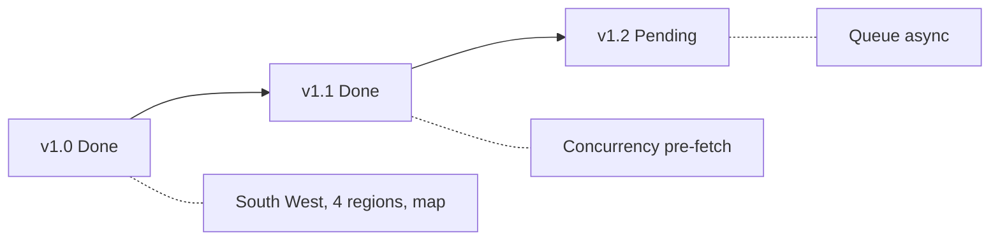

# Flood Watch Development Plan

Backlog, milestones, and future work for the Flood Watch project.

## Tooling

- **Package manager**: Yarn (`yarn.lock`). Use `yarn install`, `yarn build`, `yarn dev`. npm also works with `package.json`.
- **CI**: `.github/workflows/tests.yml` uses `yarn install --frozen-lockfile` and `yarn build`.

## Current Capabilities

- **LLM tools**: GetFloodData, GetHighwaysIncidents, GetFloodForecast, GetRiverLevels
- **Region-specific prompts**: Somerset (BA, TA), Bristol (BS), Devon (EX, TQ, PL), Cornwall (TR)
- **Resilience**: Circuit breaker, retry, Redis cache, graceful degradation
- **Dashboard**: Flood warnings, road status, map with incident markers (lat/long), 5-day forecast, weather
- **Cache pre-warming**: `flood-watch:warm-cache` command for common locations

## Backlog

| Priority | Item | Notes |
|----------|------|-------|
| High | National Rail integration | LDB API, Rail Status section, GetRailDisruption tool – see `docs/DATA_SOURCES.md` |
| Medium | Road data relevance | Filter by flood-relevance, cascading prompt – see `docs/ROAD_DATA_STRATEGY.md` |
| Medium | Expand predictive rules | Curry Moor, Salt Moor, Thorney, Devon cut-off areas – see `docs/ROAD_DATA_STRATEGY.md` |
| Medium | Queue-based async | Move `FloodWatchService::chat()` to a job for high-traffic scenarios; poll for results |
| Medium | Polygon limit tuning | Adjust `flood-watch.environment_agency.max_polygons_per_request` based on real usage |
| Medium | Real-time & push | Laravel Reverb + Web Push (FCM); see `docs/NEXT_STEPS.md` §4 |
| Low | Additional regions | Extend beyond South West if needed |
| Low | Snapshot test coverage | Ensure prompt changes are covered by `FloodWatchPromptBuilderTest` |

## Milestones

1. **v1.0** – South West coverage, all four regions, map with incident markers (done)
2. **v1.1** – Pre-fetch parallelization via `Concurrency::run()` (done)
3. **v1.2** – Optional queue-based async for high-traffic deployments

## Future Work

- **Trends**: `FloodWatchTrendService` and `flood-watch:trends` command exist; consider UI for historical flood/road patterns
- **Alerts**: Push notifications (Web Push + FCM) and WebSockets (Laravel Reverb) for real-time updates; planned in `docs/NEXT_STEPS.md` §4
- **Mobile**: Responsive dashboard; consider PWA for offline last-known status

## Reference

- Architecture: `docs/architecture.md`
- Case study: `CASE_STUDY.md`
- AI agents: `agents.md`
- **Acceptance criteria**: `docs/ACCEPTANCE_CRITERIA.md`
- Next steps: `docs/NEXT_STEPS.md`
- Road data strategy: `docs/ROAD_DATA_STRATEGY.md`
- Other data sources: `docs/DATA_SOURCES.md`
