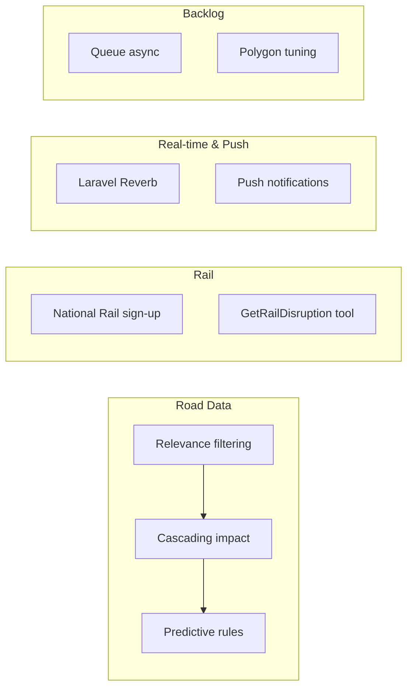

# Next Steps Development Plan

Consolidated development plan based on planning work (Feb 2026).

## 1. Road Data Strategy

**Ref**: `docs/ROAD_DATA_STRATEGY.md`

- **Relevance filtering**: Show only flood-related + paired-road incidents when floods exist
- **Cascading impact**: Update system prompt so LLM considers diversion impact, emergency access, isolation
- **Predictive rules**: Expand `flood_area_road_pairs` and `predictive_rules` (Curry Moor, Salt Moor, Stan Moor, Thorney, Devon cut-off areas)
- **Sudden change detection**: Use trends/cache to flag new closures when correlated with flood (future)

## 2. National Rail Integration

**Ref**: `docs/DATA_SOURCES.md`

- **Sign-up**: Rail Data Marketplace (raildata.org.uk) for LDB/Darwin access
- **Service**: `NationalRailService` – fetch departures/delays for key South West stations
- **Tool**: `GetRailDisruption` – LLM can call when region has rail
- **UI**: Dedicated "Rail Status" section (pill + list), mirror Road Status pattern
- **Config**: `flood-watch.rail_stations` per region (Exeter, Dawlish, Plymouth, Bristol, Taunton)
- **Attribution**: National Rail in footer

## 3. Highways Data Enrichment (in progress)

**Ref**: Plan "Best Use of National Highways Data"

- **Done**: RoadIncident enriched with startTime, endTime, locationDescription, managementType, isFloodRelated
- **Pending**: sortIncidentsByPriority, location-aware filtering (proximity), expand correlation pairs

## 4. Real-time Updates & Push Notifications

**Ref**: `docs/SITUATIONAL_AWARENESS_DASHBOARD.md`, `docs/DEPLOYMENT.md`

| Feature | Approach | Cost (Railway) |
|---------|----------|----------------|
| **WebSockets** | Laravel Reverb (self-hosted) | Included in Railway compute; add as second service or run alongside `serve` |
| **Push notifications** | Web Push API + Firebase Cloud Messaging | Free; minimal backend egress |

- **Reverb**: Real-time Activity Feed updates, live dashboard refresh when flood/road data changes
- **Push**: Browser notifications for high-severity, location-relevant events when app is closed
- **Infrastructure**: Reverb as separate Railway service or second process; Redis if scaling horizontally
- **Alternative**: Pusher Channels (free tier: 200k msg/day, 100 connections) instead of Reverb if preferred

## 5. Existing Backlog

**Ref**: `docs/DEVELOPMENT.md`

- Queue-based async for high traffic
- Polygon limit tuning

## Reference

| Doc | Purpose |
|-----|---------|
| `docs/BRIEF.md` | Revised product brief – user needs, location, route check, data architecture |
| `docs/DEPLOYMENT.md` | Railway setup, variables; cost notes for Reverb + push |
| `docs/ACCEPTANCE_CRITERIA.md` | Success checklist for revised brief |
| `docs/WIREFRAME_REVISED_BRIEF.md` | Mobile condensed + desktop enhanced wireframes |
| `docs/LLM_DATA_FLOW.md` | How data flows to the LLM – tools, prompts, pre-fetch, correlation |
| `docs/ROAD_DATA_STRATEGY.md` | Road data relevance, cascading impact, predictive rules, cut-off areas |
| `docs/DATA_SOURCES.md` | National Rail, emergency services, surfacing options |
| `docs/DEVELOPMENT.md` | Backlog, milestones, tooling |
