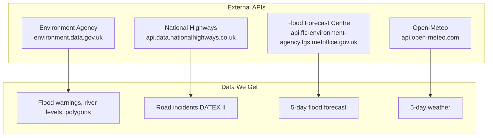
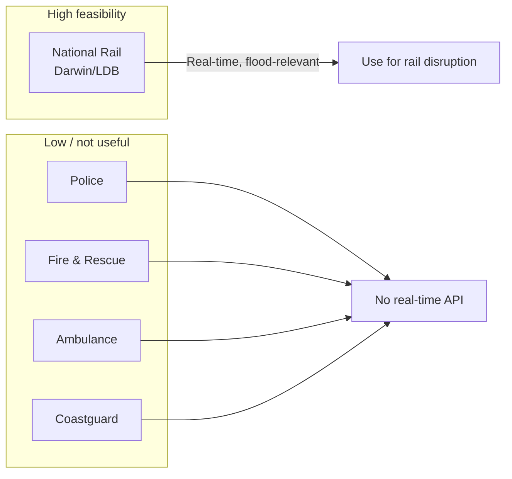
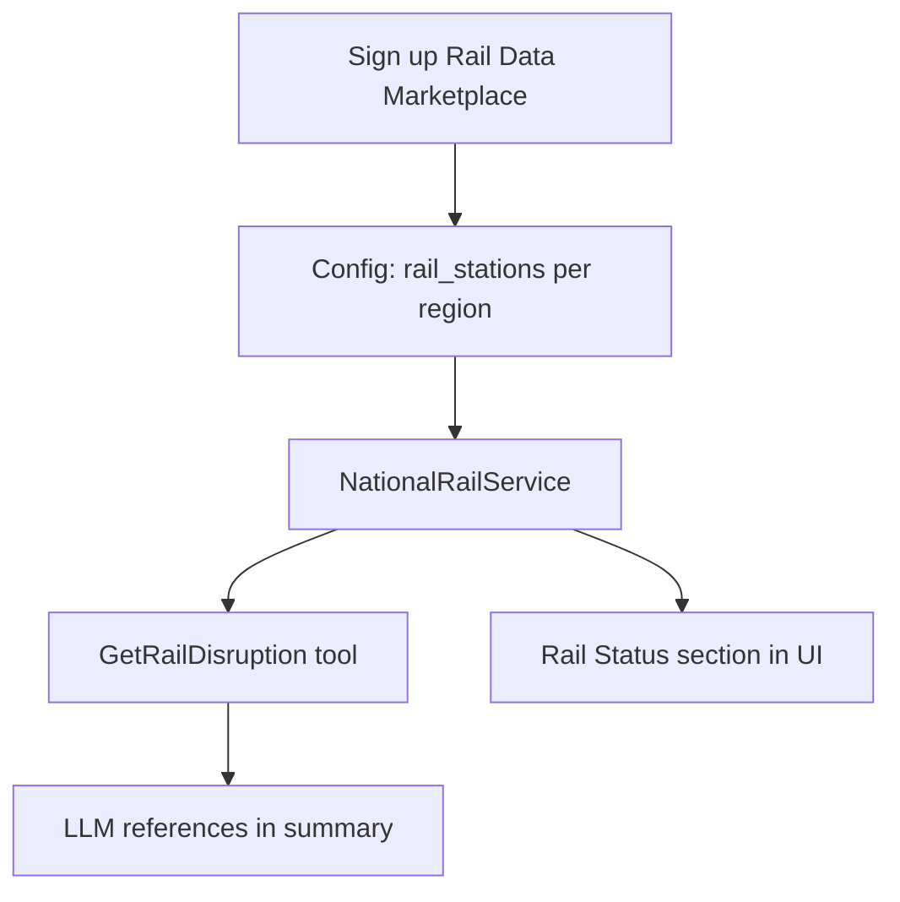

# Data Sources

Overview of data we access (current and planned), plus research on additional sources: National Rail, emergency services, and related open data.

---

## 1. Current Data Sources (Integrated)



| Source | Data | Auth |
|--------|------|------|
| **Environment Agency** | Flood warnings, river/sea levels, polygons | None |
| **National Highways** | Road incidents (closures, lane closures) | API key |
| **Flood Forecast Centre** | 5-day flood risk outlook | None |
| **Open-Meteo** | 5-day weather (temp, precipitation) | None |

---

## 2. Situational-Awareness Branch – Additions

`feature/situational-awareness` adds architecture that may be valuable for the focused BRIEF:

| Component | Purpose | Value for focused version |
|-----------|---------|----------------------------|
| **getMapData()** | Parallel fetch floods, incidents, river, forecast, weather; cache | ✅ High – instant map |
| **getMapDataUncached()** | Same without cache – for delta comparison | ✅ High – backend polling |
| **FetchLatestInfrastructureData** | Job every 15 min; fetches, compares, writes activities | ✅ High – backend polling per BRIEF |
| **InfrastructureDeltaService** | Diff previous vs current; detect changes | ⚠️ Medium – delta useful; activity feed deferrable |
| **RiskService** | Regional risk index 0–100 | ✅ High |
| **infrastructure_points** | Pumping stations, reservoirs (config) | ✅ High – Somerset Levels |
| **API-first (JSON:API)** | `/api/v1/map-data`, floods, incidents, etc. | ❌ Defer – add when SPA/mobile |
| **SystemActivity / Activity feed** | Event feed | ❌ Defer |

**Recommendations**: Adopt getMapData, getMapDataUncached, FetchLatestInfrastructureData, geographic cache, infrastructure_points. Defer full API layer and Activity feed.

---

## 3. Not Yet Integrated

| Source | Data | Feasibility | Notes |
|--------|------|-------------|-------|
| **National Rail (LDB)** | Delays, cancellations by station | High | Trackside flooding focus |
| **What3Words** | Address → coordinates | High | Free tier |
| **Geocoding (Nominatim)** | Address → coordinates | Medium | Free, rate limits |
| **Routing (OSRM)** | Route geometry | High | Free |
| **Power Cut UK** | Power outages | Medium | Flood-related |

---

## 4. National Rail (Research)

### Overview

National Rail provides real-time train running information via **Darwin**, the GB rail industry's official engine. Data includes delays, cancellations, platform changes, and schedule updates.

### Access

- **Rail Data Marketplace**: https://raildata.org.uk/ – primary sign-up for Darwin feeds
- **National Rail Developers**: https://www.nationalrail.co.uk/developers/

### Available Feeds

| Feed | Type | Use for Flood Watch |
|------|------|----------------------|
| **LDB Webservice (Live Departure Board)** | JSON API | Real-time departures, delays, cancellations by station |
| **Darwin Push Port** | Push feed | Live train movements, delays, cancellations |
| **Darwin Timetable** | Push feed | Schedule data |
| **Historic Service Performance (HSP)** | JSON API | Past performance (up to 1 year) |
| **Knowledgebase** | XML / REST | Service disruption bulletins, engineering work |

### Licensing and Limits

- **Licence**: NRE OGL (Open Government Licence with NR amendments)
- **Cost**: Free up to 5 million requests per 4-week railway period; high-volume usage may incur charges
- **Public sector** (TfL, PTEs, local authorities): No usage charges
- **Attribution**: Required per NR Brand Guidelines

### Relevance to Flood Watch

- **Primary interest**: Trackside flooding – disruption where the cause is flooding or adverse weather affecting the line
- **Dawlish line** (Exeter–Plymouth): Famous for coastal flooding; when flooded, rail is often cut
- **Exeter–London Paddington**: Stoke Canon, Cowley Bridge – river flood risk
- **Bristol area**: Temple Meads, Parkway – Severn/Avon flood correlation
- **Somerset**: Limited rail; Taunton, Bridgwater – Tone/Parrett

**Potential use**: When flood warnings exist for coastal/river areas near rail lines, surface rail disruption (delays, cancellations) to give users a fuller travel picture. Would require station–flood-area mapping.

### Technical Notes

- LDB is SOAP/JSON; Darwin Push requires persistent connection
- Open Rail Data wiki: https://wiki.openraildata.com/index.php/Main_Page
- Community: Open Rail Data-Talk (Google Groups)

---

## Emergency Services

### Police

**data.police.uk** – https://data.police.uk/

| Data | Format | Real-time? | Use for Flood Watch |
|------|--------|------------|---------------------|
| Street-level crime | JSON API | No (monthly) | Low – crime by area, not flood incidents |
| Outcomes | JSON API | No | Low |
| Neighbourhoods, teams, events | JSON API | No | Low |

**Verdict**: Not useful for flood correlation. Crime data is historical and monthly; no live incident feed.

---

### Fire and Rescue Service

**Home Office / MHCLG fire statistics** – via data.gov.uk

| Data | Format | Real-time? | Use for Flood Watch |
|------|--------|------------|---------------------|
| Fires attended | Aggregated stats | No (annual) | Low |
| Non-fire incidents | Aggregated | No | Possible – includes flooding, water rescue |
| Response times | Aggregated | No | Low |

**Verdict**: No real-time API. Fire services attend flooding and water rescues, but data is published as aggregated statistics, not live incidents. Could inform "typical" flood response patterns, not current status.

---

### Ambulance Services

**NHS Ambulance Trusts** (e.g. South Western Ambulance Service)

- No public API for real-time incidents
- Data published as aggregate statistics (response times, call volumes)
- Incident-level data is operationally sensitive

**Verdict**: No usable real-time data for Flood Watch.

---

### Maritime and Coastguard Agency (HM Coastguard)

**Role**: Search and rescue, coastal safety, maritime incidents

- **Website**: https://www.gov.uk/government/organisations/maritime-and-coastguard-agency
- **HM Coastguard overview**: https://www.gov.uk/government/organisations/maritime-and-coastguard-agency/about
- **Search and rescue stats**: Published datasets (e.g. helicopter statistics)

**Verdict**: No public API for live incidents. Coastal flood events may trigger Coastguard response, but there is no open feed of current incidents. FOI or formal data-sharing would be needed.

---

## Other Potentially Relevant Sources

### data.gov.uk

- **Flood-related**: EA flood maps, historic flood warnings, recorded flood outlines
- **Transport**: Some rail, bus, road datasets
- **Environment**: EA, Met Office, Natural England

Search: https://www.data.gov.uk/search?q=flood

### Ordnance Survey

- **Emergency Services Gazetteer**: Locations of emergency service sites (police, fire, ambulance stations)
- **Use**: Could map flood areas to nearest emergency response points
- **Licence**: Likely requires OS licence (not fully open)

### Local Resilience Forums (LRFs)

- Multi-agency bodies (EA, police, fire, ambulance, councils, utilities)
- Coordinate during emergencies including flooding
- No standard public API; communication is operational

### Utility Companies (Power, Water)

- Power cuts (e.g. Power Cut UK) – flooding can cause outages
- Water supply – no obvious public API for incidents
- Would require commercial or partnership agreements

---

## Summary: Can We Get Info from National Rail / Emergency Services?



| Source | Real-time API? | Flood-relevant? | Feasibility |
|--------|----------------|-----------------|-------------|
| **National Rail (Darwin/LDB)** | Yes | Yes (rail disruption near floods) | **High** – free tier, sign-up via Rail Data Marketplace |
| **Police (data.police.uk)** | No | No | Not useful |
| **Fire and Rescue** | No | Partial (water rescue stats) | Aggregated only |
| **Ambulance** | No | Yes (flood response) | No public API |
| **Coastguard** | No | Yes (coastal) | No public API |

**Recommendation**: National Rail is the most promising additional source. Darwin/LDB could provide rail disruption data to correlate with flood warnings (e.g. Dawlish line, Exeter–Paddington). Emergency services do not offer real-time public APIs suitable for Flood Watch.

---

## Implementation Considerations (National Rail)



1. **Sign-up**: Register at https://raildata.org.uk/ for LDB or Darwin access
2. **Station mapping**: Map South West stations to flood areas (e.g. Exeter St Davids ↔ River Exe, Dawlish ↔ coastal)
3. **Tool**: New `GetRailDisruption` or similar – call LDB for key stations when flood warnings exist
4. **Config**: `flood-watch.rail_stations` – list of stations to check per region
5. **Attribution**: Include National Rail in dashboard footer

---

## Surfacing National Rail to the User

### Option A: Dedicated "Rail Status" Section (recommended)

Mirror the existing **Road Status** pattern:

- **Quick nav pill**: Add "Rail Status" between Road Status and 5-Day Forecast (or after Road Status)
- **Section**: `#rail-status` – heading "Rail status", list of stations with delays/cancellations
- **Content**: Station name, service status (On time / Delayed / Cancelled), delay reason if available
- **When to show**: Always when we have rail data; show "No disruption" when clear
- **Conditional fetch**: Only call rail API when user's region includes rail (Devon, Bristol, Somerset/Taunton) or when flood warnings exist in rail-affected areas

**Pros**: Clear, scannable, consistent with Road Status. **Cons**: Adds another section; may feel redundant when no disruption.

---

### Option B: Integrated into LLM Summary Only

- No dedicated section; the assistant mentions rail in its "Current Status" and "Action Steps" when it calls `GetRailDisruption` and gets relevant data
- Example: "Rail services on the Exeter–Plymouth line are experiencing delays due to adverse weather. Check before you travel."

**Pros**: Minimal UI change; narrative flow. **Cons**: User may miss it; no structured data to scan; depends on LLM choosing to call the tool and emphasise it.

---

### Option C: Combined "Travel Status" (Roads + Rail)

- Merge Road Status and Rail Status into one "Travel Status" section
- Two subsections or a single list with type badges: `[Road] A361 closed`, `[Rail] Exeter St Davids – delays`

**Pros**: Single place for all travel disruption. **Cons**: Mixing road and rail may dilute clarity; Road Status is already well-established.

---

### Option D: Conditional Rail Section

- Only show Rail Status when **both**:
  - User's region has rail (Devon, Bristol, Somerset), and
  - Either (a) flood warnings exist in rail-affected areas, or (b) rail API returns disruption
- When hidden: No pill, no section

**Pros**: Reduces noise when rail is irrelevant. **Cons**: User in Somerset (Taunton) might want rail even with no floods; logic is more complex.

---

### Recommended Approach: Option A + Smart Fetching

1. **Add "Rail Status" pill and section** – same pattern as Road Status
2. **Fetch rail data** when user's region includes key rail stations (config-driven: Devon → Exeter, Dawlish, Plymouth; Bristol → Temple Meads, Parkway; Somerset → Taunton, Bridgwater)
3. **Display**: List stations with status. If no disruption: "Rail services in your area are running normally."
4. **LLM integration**: Add `GetRailDisruption` tool; assistant can reference rail in its summary and Action Steps
5. **Attribution**: "National Rail" in footer with other data sources

### Example UI (Rail Status section)

```
Rail status
─────────────────────────────────────────
Exeter St Davids    Delayed – up to 30 min (adverse weather)
Dawlish             Cancelled – line closed due to flooding
Plymouth            On time
─────────────────────────────────────────
Data from National Rail Enquiries
```

### When No Disruption

```
Rail status
─────────────────────────────────────────
Rail services in your area are running normally.
─────────────────────────────────────────
```

---

## References

- National Rail Developers: https://www.nationalrail.co.uk/developers/
- Rail Data Marketplace: https://raildata.org.uk/
- Darwin LDB documentation: https://realtime.nationalrail.co.uk/LDBWS/docs/documentation.html
- Open Rail Data wiki: https://wiki.openraildata.com/index.php/Main_Page
- data.police.uk: https://data.police.uk/docs/
- data.gov.uk: https://www.data.gov.uk/
