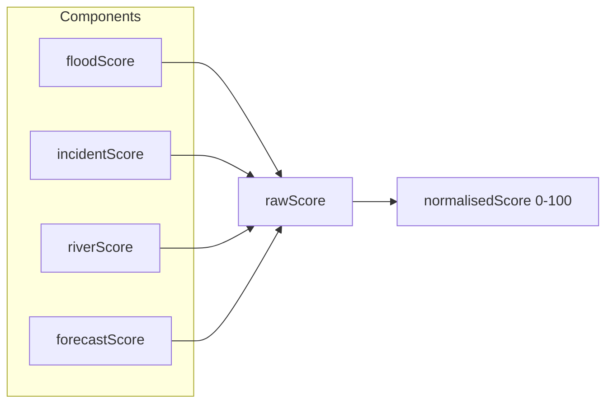
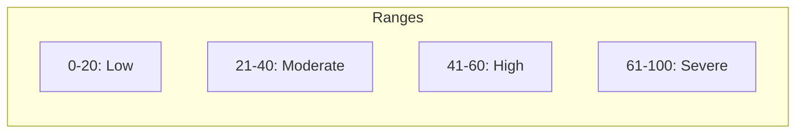

# South West Risk Index – Formula

**Created**: 2026-02-05  
**Related**: [situational_awareness_dashboard.md](./situational_awareness_dashboard.md)

## Overview

The Regional Risk Index is a weighted score from 0–100 that answers "How dangerous is it overall?" for the South West. It combines flood warnings, road incidents, river levels, and forecast trends.

---

## Inputs

| Source | Data | Used for |
|--------|------|----------|
| Environment Agency | Floods | severityLevel (1=Severe, 2=Warning, 3=Alert, 4=Inactive) |
| National Highways | Incidents | road type (A-road vs M-road), isFloodRelated, status |
| River levels | Stations | levelStatus: elevated, expected, low |
| Flood forecast | flood_risk_trend | day1–day5: increasing, stable, decreasing |

---

## Formula

### Raw score (before normalisation)



```
rawScore = floodScore + incidentScore + riverScore + forecastScore
```

### 1. Flood score (high weight)

| Severity | severityLevel | Points each | Cap |
|----------|---------------|-------------|-----|
| Severe (Danger to Life) | 1 | 25 | 50 (max 2) |
| Flood Warning | 2 | 12 | 36 (max 3) |
| Flood Alert | 3 | 5 | 15 (max 3) |

```
floodScore = min(severeCount × 25, 50) + min(warningCount × 12, 36) + min(alertCount × 5, 15)
```

### 2. Incident score (medium weight)

| Type | Points each | Cap |
|------|-------------|-----|
| Flood-related closure (isFloodRelated) | 10 | 30 |
| A-road closure | 5 | 25 |
| M-road / other closure | 3 | 15 |

An incident can count in only one category (flood-related takes precedence).

```
incidentScore = min(floodRelatedClosures × 10, 30) + min(aRoadClosures × 5, 25) + min(otherClosures × 3, 15)
```

### 3. River level score (low weight)

| Status | Points each | Cap |
|--------|-------------|-----|
| Elevated | 3 | 15 |
| Expected | 1 | 5 |

```
riverScore = min(elevatedCount × 3, 15) + min(expectedCount × 1, 5)
```

### 4. Forecast trend score (low weight)

| Trend (any day) | Points |
|-----------------|--------|
| increasing | 2 |
| stable | 0 |
| decreasing | -1 (reduces score) |

Use the worst (most concerning) trend across day1–day5. If any day is "increasing", add 2. If all are "decreasing", add -1.

```
forecastScore = hasIncreasing ? 2 : (allDecreasing ? -1 : 0)
```

---

## Normalisation to 0–100

```
maxRawScore = 50 + 30 + 25 + 15 + 15 + 5 + 2 = 142  (theoretical max)
```

In practice, use a simpler cap:

```
normalisedScore = min(100, round((rawScore / 100) × 100))
```

Or define a fixed divisor so that "typical high risk" (e.g. 2 severe + 4 closures) lands around 70–80:

```
divisor = 1.2   // tune so 2 severe + 4 closures ≈ 75
normalisedScore = min(100, round(rawScore / divisor))
```

**Recommended**: Use `min(100, rawScore)` with the caps above. The caps already limit each component, so rawScore max ≈ 142. Scale by 1.42 to get 0–100:

```
index = min(100, round(rawScore × (100 / 142)))
```

---

## Label mapping



| Index range | Label |
|-------------|-------|
| 0–20 | Low |
| 21–40 | Moderate |
| 41–60 | High |
| 61–100 | Severe |

---

## Example calculation

**Scenario**: 1 severe flood, 2 flood warnings, 3 A-road closures (1 flood-related), 4 elevated river stations, forecast "increasing"

```
floodScore   = 25 + 24 + 0           = 49
incidentScore= 10 + 10               = 20  (1 flood-related + 2 other A-roads)
riverScore   = 12                    = 12  (4 × 3, capped at 15)
forecastScore= 2                     = 2

rawScore     = 49 + 20 + 12 + 2     = 83
index        = min(100, round(83 × 100/142)) = 58  → "High"
```

---

## Config (env)

| Key | Default | Purpose |
|-----|---------|---------|
| `FLOOD_WATCH_RISK_WEIGHT_SEVERE` | 25 | Points per severe flood |
| `FLOOD_WATCH_RISK_WEIGHT_WARNING` | 12 | Points per flood warning |
| `FLOOD_WATCH_RISK_WEIGHT_ALERT` | 5 | Points per flood alert |
| `FLOOD_WATCH_RISK_WEIGHT_FLOOD_CLOSURE` | 10 | Points per flood-related road closure |
| `FLOOD_WATCH_RISK_WEIGHT_A_ROAD` | 5 | Points per A-road closure |
| `FLOOD_WATCH_RISK_WEIGHT_ELEVATED` | 3 | Points per elevated river station |
| `FLOOD_WATCH_RISK_MAX_INDEX` | 100 | Normalisation cap |
