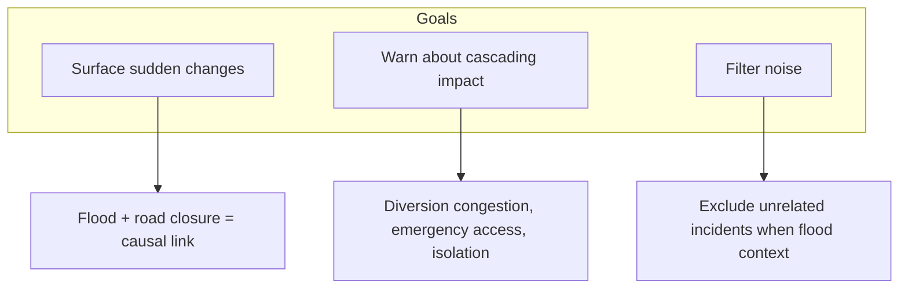
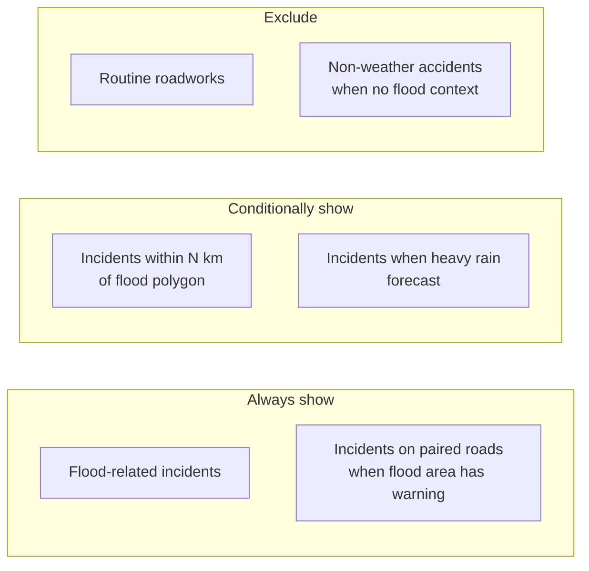
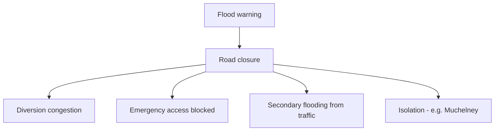

# Road Data Strategy: Flood and Bad Weather Relevance

## Vision

Use National Highways road data **only where it is relevant** to flooding and bad weather. The goal is to:

1. **Surface sudden changes** – A flood creates a road closure; when both appear together, highlight the causal link
2. **Warn about cascading impact** – A road closure near a flood site can cause more issues in surrounding areas (diversion congestion, emergency access blocked, secondary flooding from traffic)
3. **Filter noise** – Exclude road incidents that are unrelated to weather (e.g. routine roadworks, non-flood accidents) when the user cares about flood viability

---

## Current State

- **Road incidents**: Fetched from National Highways (planned + unplanned closures), filtered by region roads (A361, M5, etc.), displayed on map and in summary
- **Correlation**: Config-driven `flood_area_road_pairs` (e.g. North Moor ↔ A361); `RiskCorrelationService` checks if a paired road has an incident
- **Predictive rules**: Muchelney cut-off when Parrett elevated; Langport flood → Muchelney access warning
- **Relevance**: We have `isFloodRelated` on incidents (from DATEX II `environmentalObstructionType: flooding`) but we still show all incidents on allowed roads

---

## Concepts to Explore

### 1. Relevance Filtering

**When to show road data**:
- Flood-related incidents (isFloodRelated) – always relevant
- Incidents on roads in `flood_area_road_pairs` – always relevant when that flood area has a warning
- Incidents within N km of an active flood polygon – spatially relevant
- Incidents when weather forecast shows heavy rain – pre-emptive relevance
- **Exclude**: Routine roadworks, non-weather accidents when no flood/weather context

**Open question**: Strict filter (only flood-relevant) vs. soft filter (prioritise flood-relevant, show others lower)? User preference?

---

### 2. Sudden Change Detection

**Idea**: When a road closure appears and we have a flood warning in the same area, treat it as a **likely flood-induced closure**.

**Requirements**:
- Historical state: previous incident set (from cache, trends, or last request)
- Compare: new closure on road X + flood in area Y near X → flag as "sudden change – likely flood-related"
- Could feed into LLM: "A361 has just been closed. Active flood warning for North Moor. This closure is likely due to flooding."

**Challenges**: Cache/trends may not have recent enough data; need to define "same area" (config pairs vs. spatial).

---

### 3. Cascading Impact Warnings

**Idea**: A road closure near a flood site doesn’t just block that road – it affects surrounding areas.

**Potential impacts**:
- **Diversion congestion** – Traffic diverted onto other routes; those routes may also be at flood risk
- **Emergency access** – Ambulances, fire, rescue may be delayed or blocked
- **Secondary flooding** – Congested traffic on alternative routes near flood zones; vehicles stranded
- **Isolation** – Villages (e.g. Muchelney) cut off when both primary and diversion routes are affected

**Implementation options**:
- **Config-driven**: Add `cascading_rules` – e.g. "When A361 closed and North Moor flooded, warn: diversion via A372 may congest; Muchelney access at risk"
- **LLM prompt**: Instruct the assistant to consider cascading effects when summarising
- **Deterministic logic**: `RiskCorrelationService` computes "surrounding area at risk" when flood + road closure pair matches

---

### 4. Bad Weather + Road Correlation

**Idea**: Heavy rain (from weather forecast) + road incident = higher relevance, even if no flood warning yet.

**Example**: "Heavy rain expected tomorrow. A361 has lane closures for maintenance. Monitor for flooding – this stretch is prone to surface water."

**Requirements**:
- Weather data: we have 5-day forecast with precipitation
- Config: roads prone to surface water / known flood hotspots
- Correlation: precipitation > threshold + incident on that road → elevate relevance

---

## Data We Have (and Gaps)

| Data | Source | Use for strategy |
|------|--------|-------------------|
| Flood warnings | EA | Flood polygons, severity, area names |
| Road incidents | NH | road, status, incidentType, isFloodRelated, lat/long |
| River levels | EA | Rising levels → predictive |
| Flood forecast | FGS | 5-day risk trend |
| Weather | Open-Meteo | Precipitation, heavy rain |
| Flood–road pairs | Config | North Moor ↔ A361, etc. |
| **Gap** | – | Historical incidents (for sudden change) |
| **Gap** | – | Flood polygon geometry (for spatial "near") – we have polygons for map, may not use for correlation |
| **Gap** | – | Diversion routes (NH API exists but not integrated) |

---

## Proposed Phases (for discussion)

| Phase | Focus | Effort |
|-------|-------|--------|
| **1. Relevance filtering** | Show only flood-related + paired-road incidents when floods exist; optionally include all when no floods (user choice) | Medium |
| **2. Cascading prompt** | Update system prompt so LLM considers diversion impact, emergency access, isolation when road closed near flood | Low |
| **3. Cascading rules** | Add config-driven cascading warnings to RiskCorrelationService | Medium |
| **4. Sudden change** | Use trends/cache to detect new closures; flag when correlated with flood | Medium (needs trends data) |
| **5. Bad weather + road** | Correlate precipitation forecast with incidents on known flood-prone roads | Medium |

---

## Decisions Needed

1. **Strict vs. soft filtering**: Only flood-relevant incidents, or prioritise them but show others?
2. **Cascading**: Config rules vs. LLM-only vs. both?
3. **Sudden change**: Is trends/cache data available and fresh enough?
4. **Bad weather**: Which roads are "flood-prone" – config per region or external dataset?

---

---

## Predictive Rules and Cut-Off Areas (Research)

### Somerset Levels – Known Cut-Off Areas

| Area | Flood trigger | Road at risk | Notes |
|------|---------------|--------------|-------|
| **Muchelney** | River Yeo/Parrett Moors, Langport | A361, Law Lane, Wetmoor Lane | Already in config. Access via Langport; cut off when moors flood |
| **Thorney** | River Yeo/Parrett Moors | Law Lane from Thorney, Wetmoor Lane | Adjacent to Muchelney; same access routes |
| **Athelney** | Stan Moor, Curload | Stanmoor Road, A361 | Historic island; Stan Moor floods |
| **Burrowbridge, East Lyng, Moorland, Fordgate** | Salt Moor, North Moor | A361 East Lyng–Burrowbridge | EA label: "A361 East Lyng to Burrowbridge" – explicit flood area |
| **Curload** | Stan Moor | Stanmoor Road | Small settlement on Stan Moor |
| **North Curry area** | Curry Moor, Hay Moor | New Road (North Curry–A361), Cutts Road East Lyng | Access roads flood |

**Existing config**: North Moor ↔ A361, Sedgemoor ↔ A361. **Gaps**: King's Sedgemoor (in prompt but not config), Curry Moor, Hay Moor, Stan Moor, Salt Moor, Thorney, Athelney.

---

### Devon – Potential Cut-Off Areas

| Area | Flood trigger | Road at risk | Notes |
|------|---------------|--------------|-------|
| **Hatherleigh / Black Torrington** | River Torridge | A386 Hele Bridge, B3227 | "riverside locations and roads between Bradford and Dolton" |
| **North Tawton** | River Taw (Upper) | A3072 Newland Mill | Taw Bridge, Mill Lane |
| **Umberleigh** | River Taw (Lower) | A377, B3277 | Exeter–Barnstaple railway also at risk |
| **Bickleigh** | River Exe | A396, A3072 | Tiverton–Exeter corridor |
| **Stoke Canon** | River Exe, River Culm | A396, Exeter–Paddington railway | Low-lying; key transport corridor |
| **Kingsbridge / South Brent / Ivybridge** | Avon, Erme, Harbourne | A379, A38 | Estuary communities |
| **Dartmouth / Kingswear** | Dart estuary | Ferry, A379 | Coastal; ferry can be suspended |
| **Slapton / Torcross** | Coastal | A379 Slapton Ley | Famous 1944 exercise area; road floods |
| **Lympstone / Exmouth** | Coastal, River Exe | A376, railway | Dawlish line at risk |
| **Cullompton** | River Culm | Station Road, A373 | Low-lying town |
| **Barnstaple / Bishops Tawton** | River Taw | A377, A361 Braunton Road | Tidal Taw; Braunton Road mentioned |

---

### Cornwall – Potential Cut-Off Areas

| Area | Flood trigger | Road at risk | Notes |
|------|---------------|--------------|-------|
| **Plymouth Sound / Tamar** | Tidal Tamar, Lynher, Tavy, Plym, Yealm | A38, A374, ferries | Multi-estuary; Cawsand, Kingsand, Millbrook |
| **Looe / Fowey** | Coastal, river | A387, A390 | Coastal communities |

---

### Bristol – Potential Cut-Off Areas

| Area | Flood trigger | Road at risk | Notes |
|------|---------------|--------------|-------|
| **Avonmouth / Severn** | Severn estuary | M5, M4 junctions, A403 | Industrial; Swanmoor Bridge, Western Approach |
| **Bristol Frome** | Bristol Frome | Eastville, Muller Road | Urban flooding |

---

### Additional Predictive Rules We Could Add

| Rule type | Trigger | Warning |
|-----------|---------|---------|
| **River Tone elevated** | River Tone level elevated | Curry Moor, Hay Moor access at risk; A361 at East Lyng may flood |
| **Curry Moor / Hay Moor flood** | Flood warning for Curry Moor, Hay Moor | New Road North Curry–A361 and Cutts Road East Lyng at risk |
| **Salt Moor / North Moor flood** | Flood warning for Salt Moor, North Moor | A361 East Lyng–Burrowbridge; Burrowbridge, Moorland, Fordgate access at risk |
| **Stan Moor flood** | Flood warning for Stan Moor | Athelney, Curload cut off; Stanmoor Road impassable |
| **River Exe elevated** | River Exe level elevated | Bickleigh, Stoke Canon, Exeter low-lying areas; A396, A3072 at risk |
| **River Taw elevated** | River Taw level elevated | North Tawton, Umberleigh, Barnstaple; A377, A3072 at risk |
| **Coastal surge (Bristol Channel)** | Coastal flood warning | Avonmouth, Severn estuary; M5/M4 junctions |
| **Heavy rain + known hotspot** | Precipitation > threshold + flood-prone road | "Heavy rain expected. [Road] is prone to surface water. Monitor for flooding." |

---

### Flood Area ↔ Road Pairs to Expand (from EA data)

**Somerset** (add to `flood_area_road_pairs`):
- Curry Moor, Hay Moor → A361, New Road
- Salt Moor, North Moor → A361 (East Lyng–Burrowbridge)
- Stan Moor → Stanmoor Road, A361
- River Yeo and Parrett Moors (Muchelney, Thorney) → A361, Law Lane, Wetmoor Lane
- A361 East Lyng to Burrowbridge (EA label) → A361

**Devon** (new region pairs):
- River Taw (Upper) North Tawton → A3072
- River Exe Bickleigh/Stoke Canon → A396, A3072
- River Torridge Hatherleigh → A386
- Slapton/Torcross → A379

**Bristol** (new region pairs):
- Severn estuary Avonmouth → M5, M4, A403

---

## References

- `docs/architecture.md` – Data flow, correlation config
- `docs/DEVELOPMENT.md` – Backlog, future work
- `config/flood-watch.php` – `correlation` config, `flood_area_road_pairs`
- `app/Services/RiskCorrelationService.php` – Current correlation logic
- Environment Agency flood areas: `https://environment.data.gov.uk/flood-monitoring/id/floodAreas?lat=51&long=-3&dist=80`
