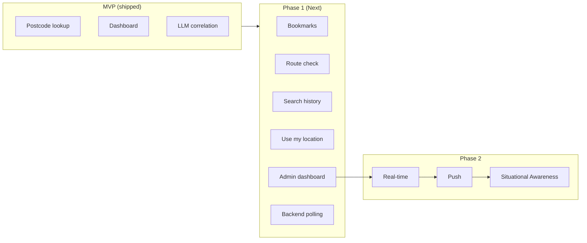

# Flood Watch – Development Plan

**Ref**: `docs/brief.md`  
**Date**: 2026-02-05

Single development plan consolidating roadmap, backlog, data sources, and implementation notes.

---

## Cursor Agentic Build (Build Today)

Effort estimates assume **Cursor agentic** (AI-assisted development). Phase 1 items can be built in **hours–days**.

**Build order** (see `docs/build/README.md`):

0. **Foundation** (do first): Migrations, models, config, admin gate, reverse-geocode, lang; ~45–60 min  
1. **Admin dashboard** (early) → 2. Search history → 3. Use my location → 4. Bookmarks → 5. Route check → 6. Donations → 7. Backend polling

**Agentic tips**: Use plan mode for docs; switch to agent mode for implementation. Run tests after each feature. TDD: failing test first, then implementation.

**Implementation specs**: `docs/build/` – per-feature build specs for Cursor (migrations, models, services, tests, UI).

---

## MVP (Shipped)

What's **built and in the codebase** today. Verified against current implementation.

| Feature | Status | Notes |
|---------|--------|-------|
| Postcode lookup | Done | postcodes.io |
| Place name lookup | Done | Nominatim (no What3Words) |
| Dashboard (floods, roads, map, forecast, weather, river levels) | Done | Livewire, map-data API |
| LLM correlation (flood–road advice) | Done | FloodWatchService + tools |
| Graceful degradation | Done | Partial data when API fails |
| Danger to life (emergency numbers, instructions) | Done | In prompt + config |
| Registration / login | Done | Laravel auth |
| Guest rate limit | Done | 1 search per 15 min; registered unlimited |
| Circuit breaker, retry | Done | Per-service |
| Cache layer | Done | TTL configurable; default 0 (disabled) |
| localStorage persistence | Done | Last location + results for offline |

**Data flow**: On-demand fetch per search (no scheduled backend polling). Cache reduces API/LLM calls when TTL > 0.

**LLM tools**: GetFloodData, GetHighwaysIncidents, GetFloodForecast, GetRiverLevels  
**Regions**: Somerset (BA, TA), Bristol (BS), Devon (EX, TQ, PL), Cornwall (TR)  
**Tooling**: Yarn, CI via `.github/workflows/tests.yml`

---

## Phase 1 (Next)

Planned features that are **not** in the current codebase:

| Item | Notes |
|------|-------|
| Location bookmarks | Multiple locations per registered user; profile default |
| Profile default location | Pre-loaded on app open; feeds admin metrics |
| **Route check (From/To)** | Geocode From + To; overlay incidents/floods on route; Clear / Blocked / At risk / Delays summary |
| Search history (DB) | Store searched locations; recent searches UI |
| Use my location (GPS) | Browser geolocation; "Use my location" button |
| Admin dashboard | API health, LLM cost, user metrics, budget alerts |
| Backend polling | Scheduled job fetches APIs; required before geographic caching can work |
| Donations | "Support Flood Watch" link in footer |

---

## Phase 2: Situational Awareness (Registered Users)

**Vision**: Operational dashboard that auto-refreshes every 15 min; no need to re-run searches.

| Feature | Approach |
|---------|----------|
| **Risk gauge** | 0–100 index from floods, incidents, river levels, forecast |
| **Status grid** | Hydrological, infrastructure, weather, AI advisory |
| **Activity feed** | Live events (new warning, road opened/closed); Laravel Reverb |
| **Push notifications** | Web Push + FCM for high-severity, location-relevant events |
| **Backend polling** | Job every 15 min; delta comparison; emit events on change |

**Cost**: Gate behind auth; AI tokens and background jobs incur higher spend.

---

## Roadmap

---

## Backlog (by Priority)

| Priority | Item | Notes |
|----------|------|-------|
| High | Location bookmarks + profile default | Model, migration, UI |
| High | Search history (DB) | Store searched locations; schema below |
| High | Use my location (GPS) | Browser geolocation; "Use my location" button in UI |
| High | Route check (From/To) | Geocode both; overlay incidents/floods; Clear/Blocked/At risk summary |
| High | Admin dashboard | API health, LLM cost, user metrics, budget alerts |
| High | Backend polling | Scheduled job (15 min); required for geographic caching |
| High | National Rail | LDB API, GetRailDisruption tool, Rail Status section |
| Medium | Road data relevance | Filter flood-related; cascading prompt |
| Medium | Expand predictive rules | Curry Moor, Salt Moor, Thorney, Devon cut-off |
| Medium | Analytics layer | Event storage, reporting, admin reports; see below |
| Medium | Real-time & push | Laravel Reverb + FCM; see Phase 2 |
| Medium | Queue-based async | For high-traffic; poll for results |
| Low | Polygon limit tuning | `max_polygons_per_request` |
| Low | Additional regions | Beyond South West; see `docs/CONSIDERATIONS.md` |
| Low | Test coverage visibility | Document critical paths; consider `--coverage` in CI |
| Low | Postcode sector cache key | Use sector (TA10 0) not full (TA10 0DP) for cache; reduces cost |
| Low | Cache warming | Schedule `flood-watch:warm-cache`; region-based locations; see below |
| Low | Donations | "Support Flood Watch" link in footer; Ko-fi / PayPal / Buy Me a Coffee |
| Low | **Manual refresh for results** | The manual refresh control was removed from the results header, and there is no other "Refresh" action wired to rerun search once results are shown. If users need to update results on demand (especially guests without auto-poll), consider reintroducing a refresh button in the location header or results layout. |

---

## Summary (AI advice) on mobile – Plan

**Current state**: The **Summary** is the LLM’s final narrative (flood/road correlation, advice, risk). On mobile it is rendered at the **bottom** of the results (after risk block, route check, flood warnings, nav links, weather, road status). Users may scroll past it or never see it, even though it’s the main “so what?” output.

**Goal**: Surface the Summary more effectively on mobile so the AI advice is visible and useful without burying detail.

**Options to consider**:

| Option | Description | Pros | Cons |
|--------|-------------|------|------|
| **Move Summary higher** | Place Summary immediately after Risk block (and optionally Route check), before Flood Warnings / Weather / Road Status. | User sees the narrative first; aligns with “advice then detail”. | Long summary can push detail far down; may want a “Read more” or height cap. |
| **Collapsible “AI advice” at top** | Add an “AI summary” or “Advisory” block at top (below summary bar) with first 1–2 sentences or a short bullet list; tap to expand full Summary. | High visibility; full text still available. | Requires truncation or extraction (e.g. first paragraph); two places for same content if we keep full Summary below. |
| **Sticky / floating summary** | After first scroll, show a compact “AI advice” bar that sticks or floats; tap opens full Summary in sheet/modal. | Always accessible; doesn’t take initial space. | More UI complexity; risk of overlapping content. |
| **Replace or augment summary bar** | Use the LLM to generate the one-line summary bar text (e.g. “2 flood warnings · A361 closed · 3:45 pm”) or add a second line “AI: …” under it. | Single line of high-value context at very top. | Token/UX trade-off; may need short dedicated LLM output or template. |
| **Two-phase layout** | “Overview” tab/section: Risk + Summary + key bullets; “Details” tab/section: Flood list, Road status, Weather, etc. | Clear separation of “what to do” vs “raw data”. | Tab/section UX; more navigation. |

**Recommendation for plan**: Decide whether **priority is “advice first”** (move or duplicate Summary higher) or **“glanceable + expand”** (short teaser at top, full Summary expandable). Then add a concrete backlog item (e.g. “Mobile: surface LLM Summary higher or as expandable AI advice”) and reference this section.

---

## Donations (Plan)

Users support the project via **donations**. The app stays free; donations offset API and hosting costs.

| Element | Placement |
|---------|-----------|
| **Footer** | "Support Flood Watch" link |
| **Profile** | "Support this project" (optional) |
| **Platform** | Ko-fi, Buy Me a Coffee, or PayPal – external link |

**Approach**: Soft ask, non-intrusive. No in-app payment processing; link to external donation page.

**Ref**: `docs/archive/MONETISATION_plan.md` for platform comparison.

---

## Cache Warming (Plan)

Use scheduled cache warming to improve first-request latency and reduce cold-cache misses.

**Approach**:

1. **Config**: Add `flood-watch.warm_cache_locations` – one representative location per region (e.g. Langport, Bristol, Exeter, Truro).
2. **Command**: Extend `flood-watch:warm-cache` with `--regions=` option; resolve each location via `LocationResolver`; pass lat, long, region to `chat()`.
3. **Schedule**: Run every 15 min in `routes/console.php` (align with cache TTL).
4. **Region-scoping**: Warm by region so Somerset users hit Somerset cache; no cross-region pollution.

**Effort**: ~1–2 h (agentic).

---

## Search History (Database) – Plan

Store locations users have searched in a database for quick re-search, analytics, and admin metrics.

**Schema**: See **`docs/schema.md`** – `user_searches` table (user_id nullable, session_id for guests, lat, long, region, searched_at).

- **Guests**: Store with `user_id = null`, `session_id` for deduplication; retention e.g. 90 days
- **Registered**: Associate with `user_id`; show "Recent searches" in UI (dropdown or quick-pick)
- **Admin**: Top regions, top postcodes, search volume over time

**Effort**: ~1–2 h (agentic).

---

## Use My Location (GPS) – Plan

Allow users to use phone GPS for instant location lookup.

**Approach**:

1. **UI**: "Use my location" button/link next to the location input (mobile + desktop).
2. **Browser API**: `navigator.geolocation.getCurrentPosition()` – requires HTTPS (Railway provides).
3. **Flow**: User taps → browser prompts for permission → get lat/long → reverse-geocode to postcode/place name for display, or use coords directly for search.
4. **Fallback**: If denied or error, show message: "Could not get location. Try entering a postcode."
5. **Display**: Show "📍 Current location" or resolved place name (e.g. "Near Langport").

**Effort**: ~30 min (agentic).

---

## Analytics Layer (Plan)

Build an **analytics layer** to support reporting and operational insights.

**Purpose**:
- Admin reports: search volume, top regions/postcodes, user growth
- Operational: API usage, cache hit rate, LLM cost trends, error rates
- Regional: flood/incident counts over time, correlation with search spikes

**Data sources**:
- `user_searches` – location, region, searched_at (already planned)
- **Analytics events** (optional): API calls, cache hits, errors, LLM tokens – if more granular reporting needed
- **API snapshots** (optional): Periodic flood/incident counts by region for historical trend charts

**Reporting outputs**:
- Admin dashboard: time-series charts (searches/day, cost/day), top regions, top postcodes
- Export: CSV for external analysis
- Alerts: e.g. budget threshold, error spike

**Storage**: Database tables for events/snapshots; aggregate views or scheduled jobs for reports. Laravel Pulse may cover some metrics; custom tables for business-specific analytics.

**Effort**: ~1–2 days depending on scope (agentic).

---

## Geographic Cache Keys

Define granularity for cache key scoping:

| Type | Granularity | Example | Notes |
|------|-------------|---------|-------|
| **Postcode sector** | Outcode + first digit of incode | `TA10 0`, `BS3 2` | Full postcode `TA10 0DP` → key `TA10 0`; ~2–3 km radius |
| **Grid cell (lat/long)** | 2 decimal places ≈ 1.1 km | `51.04,-2.83` | Place names (Langport, Bristol); rounded bounds |
| **Region** | somerset, bristol, devon, cornwall | `somerset` | For region-wide data (road incidents) |

**Cache key format**: `{prefix}:{type}:{region}:{sector_or_cell}` e.g. `flood-watch:chat:somerset:TA10 0`. Backend polling must populate the store before geographic caching is effective.

---

## Admin Dashboard – Cost & Budget

| Element | Detail |
|---------|--------|
| **LLM cost** | Requests today/month; est. spend (gpt-4o-mini ~$0.01–0.10/request) |
| **Budget alert** | Threshold configurable (e.g. $20/month); warn when approaching limit |
| **Threshold logic** | Alert at 80% of budget; hard stop optional (e.g. disable LLM at 100%) |
| **Source** | Track via OpenAI usage API or infer from request count × avg tokens |

---

## Quality Assurance

| Area | Target | Notes |
|------|--------|-------|
| **Test coverage** | >80% | Run `sail test --coverage`; critical paths: FloodWatchService, RiskCorrelationService, LocationResolver |
| **CI** | `.github/workflows/tests.yml` | Build frontend, run Pest on push/PR |
| **Deployment verification** | Pre-deploy checklist | See `docs/deployment.md` – API keys, coverage, graceful failure, regional test |
| **Critical paths** | Documented | FloodWatchService (tool calling, cache), RiskCorrelationService, circuit breaker |

---

## Data Sources

**Current**: Environment Agency, National Highways, Flood Forecast, Open-Meteo

**Planned**: National Rail (LDB/Darwin via raildata.org.uk) – departures/delays for South West stations

---

## Real-time & Push (Cost)

| Feature | Approach | Railway cost |
|---------|----------|--------------|
| WebSockets | Laravel Reverb | Included in compute |
| Push | Web Push + FCM | Free |

Reverb as second service or process; Redis if scaling. Alternative: Pusher (free tier: 200k msg/day).

---

## Future Improvements

| Item | Notes |
|------|-------|
| Nominatim rate limiting | Cache reverse geocode by rounded lat/lng for short periods so repeated GPS searches don't hit Nominatim every time (Use My Location). |

---

## Reference

| Doc | Purpose |
|-----|---------|
| `docs/brief.md` | Product brief |
| `docs/ACCEPTANCE_CRITERIA.md` | Success checklist |
| `docs/WIREFRAMES.md` | UI wireframes |
| `docs/architecture.md` | System structure, data flow |
| `docs/agents-and-llm.md` | How LLM consumes data (tools, APIs, flow) |
| `docs/deployment.md` | Railway runbook, pre-launch checklist |
| `docs/performance.md` | OSRM limits, self-hosting, scaling options |
| `docs/TROUBLESHOOTING.md` | LLM timeout, circuit breaker, cache |
| `docs/CONSIDERATIONS.md` | Risks, API dependency, regional scope, costs |
| `docs/DATA_SOURCES.md` | Current + planned APIs; National Rail implementation plan |
| `docs/NEXT_STEPS.md` | Success metrics, extended next steps |
| `docs/schema.md` | Database schema, object map, entity relationships |
| `docs/build/` | Implementation specs for Cursor (per-feature build order) |
