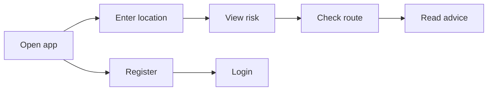

# Flood Watch – Wireframes

**Ref**: `docs/brief.md`, `docs/plan.md`

---

## Part 1: MVP (Search-First)

### User Journey

### Mobile

**Guest**: `[Login] [Register]` · **Logged in**: `[Location ▼] [👤]`

- Location at top; **Use my location** button (GPS) next to input; bookmarks dropdown for registered
- Recent searches (from DB) shown as quick-pick when changing location
- Risk → Action steps → Route check
- Danger to life: 999, Floodline 0345 988 1188, evacuation instructions

### Desktop

- Risk + Route check side by side; map; flood/road lists
- **Use my location** (GPS) button next to location input
- Profile: default location, bookmarks; recent searches from DB
- Admin: API health, LLM cost, user metrics

### Danger to Life

| Element | Content |
|---------|---------|
| Emergency numbers | 999 · Floodline 0345 988 1188 |
| Instructions | Evacuate if advised · Move to higher ground · Do not enter floodwater |

### Admin Dashboard

- **API health**: EA, Flood Forecast, Weather, National Highways, Cache
- **LLM cost**: Requests today/month, est. spend, budget alert
- **User metrics**: Total users, active (7d), searches, default locations, top regions/postcodes
- **Analytics / Reports**: Time-series (searches/day, cost/day), top regions/postcodes, CSV export; see `docs/plan.md` Analytics Layer

### Support (Donations)

- **Footer**: "Support Flood Watch" link → Ko-fi / PayPal / Buy Me a Coffee
- **Profile** (optional): "Support this project" for registered users
- Non-intrusive; app remains free

---

## Part 2: Situational Awareness (Phase 2)

**Registered users only**. Auto-refresh every 15 min.

### Layout

- **Header**: Location dropdown, Check my location, Profile
- **Risk gauge**: 0–100, colour bands
- **Status grid**: Hydrological, Infrastructure, Weather, AI Advisory
- **Activity feed**: Live events (new warning, road opened/closed)
- **Map**: Full-width; same Leaflet as MVP

### Guest vs Registered

| Area | Guest | Registered |
|------|-------|------------|
| Hero | Search + Check status | Risk gauge + Status grid |
| Map | After search | Always visible, auto-refresh |
| Activity | None | Live feed |
| Admin | — | `/admin-dashboard` |

---

## HTML Wireframes

- `public/wireframes/revised-brief.html` – MVP (includes Route Check component states: empty, loading, clear, blocked, at risk, delays, error)
- `public/wireframes/situational-awareness.html` – Phase 2
- `public/wireframes/mobile-wireframe-with-summary.html` – Mobile: 3 options for Summary (AI advice) placement (moved higher, collapsible teaser, sticky bar). Ref: docs/plan.md § Summary on mobile – Plan
